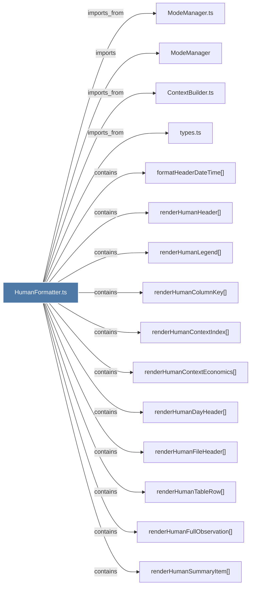

# HumanFormatter.ts

> [!info] Properties
> **File Type**: code
> **Community**: [[_COMMUNITY_Community None|Community None]]
> **Degree**: 23

## Architecture Graph


## Outbound Connections
- [[ContextBuilder.ts]] - `imports_from` [EXTRACTED]
- [[FooterRenderer.ts]] - `imports_from` [EXTRACTED]
- [[HeaderRenderer.ts]] - `imports_from` [EXTRACTED]
- [[ModeManager]] - `imports` [EXTRACTED]
- [[ModeManager.ts]] - `imports_from` [EXTRACTED]
- [[SummaryRenderer.ts]] - `imports_from` [EXTRACTED]
- [[TimelineRenderer.ts]] - `imports_from` [EXTRACTED]
- [[formatHeaderDateTime()]] - `contains` [EXTRACTED]
- [[renderHumanColumnKey()]] - `contains` [EXTRACTED]
- [[renderHumanContextEconomics()]] - `contains` [EXTRACTED]
- [[renderHumanContextIndex()]] - `contains` [EXTRACTED]
- [[renderHumanDayHeader()]] - `contains` [EXTRACTED]
- [[renderHumanEmptyState()]] - `contains` [EXTRACTED]
- [[renderHumanFileHeader()]] - `contains` [EXTRACTED]
- [[renderHumanFooter()]] - `contains` [EXTRACTED]
- [[renderHumanFullObservation()]] - `contains` [EXTRACTED]
- [[renderHumanHeader()]] - `contains` [EXTRACTED]
- [[renderHumanLegend()]] - `contains` [EXTRACTED]
- [[renderHumanPreviouslySection()]] - `contains` [EXTRACTED]
- [[renderHumanSummaryField()]] - `contains` [EXTRACTED]
- [[renderHumanSummaryItem()]] - `contains` [EXTRACTED]
- [[renderHumanTableRow()]] - `contains` [EXTRACTED]
- [[types.ts_12]] - `imports_from` [EXTRACTED]

## Inbound Dependencies
> [!abstract]- Files that link here
```dataview
LIST
FROM [[HumanFormatter.ts]]
```

#graphify/code #graphify/EXTRACTED #community/Community_None