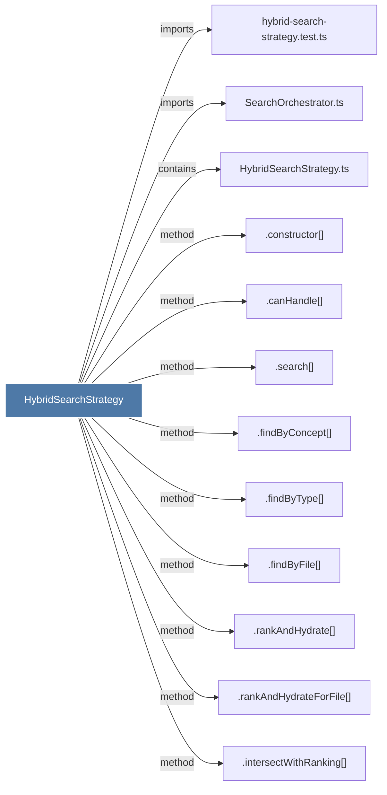

# HybridSearchStrategy

> [!info] Properties
> **File Type**: code
> **Community**: [[_COMMUNITY_Community None|Community None]]
> **Degree**: 12

## Architecture Graph


## Outbound Connections
- [[.canHandle()_1]] - `method` [EXTRACTED]
- [[.constructor()_16]] - `method` [EXTRACTED]
- [[.findByConcept()_2]] - `method` [EXTRACTED]
- [[.findByFile()_2]] - `method` [EXTRACTED]
- [[.findByType()_2]] - `method` [EXTRACTED]
- [[.intersectWithRanking()]] - `method` [EXTRACTED]
- [[.rankAndHydrate()]] - `method` [EXTRACTED]
- [[.rankAndHydrateForFile()]] - `method` [EXTRACTED]
- [[.search()_3]] - `method` [EXTRACTED]
- [[HybridSearchStrategy.ts]] - `contains` [EXTRACTED]
- [[SearchOrchestrator.ts]] - `imports` [EXTRACTED]
- [[hybrid-search-strategy.test.ts]] - `imports` [EXTRACTED]

## Inbound Dependencies
> [!abstract]- Files that link here
```dataview
LIST
FROM [[HybridSearchStrategy]]
```

#graphify/code #graphify/EXTRACTED #community/Community_None