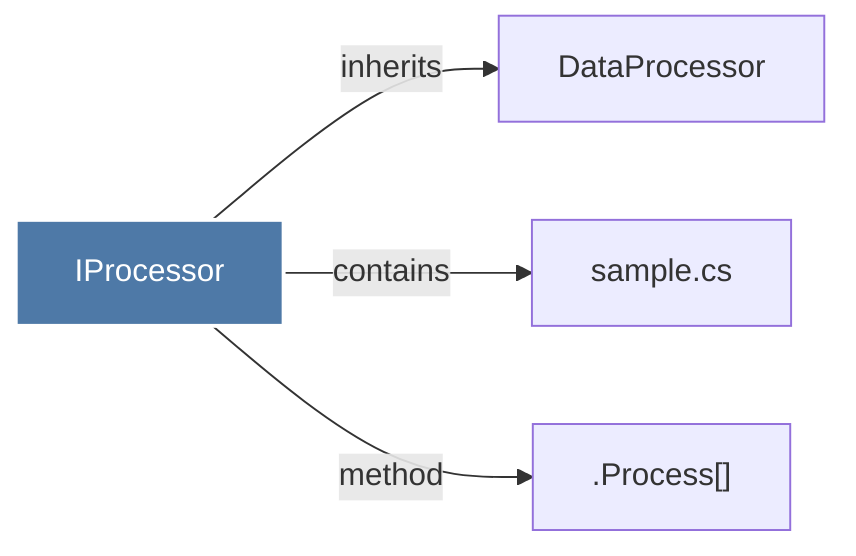

# IProcessor

> [!info] Properties
> **File Type**: code
> **Community**: [[_COMMUNITY_Community None|Community None]]
> **Degree**: 3

## Architecture Graph


## Outbound Connections
- [[.Process()_1]] - `method` [EXTRACTED]
- [[DataProcessor]] - `inherits` [EXTRACTED]
- [[sample.cs]] - `contains` [EXTRACTED]

## Inbound Dependencies
> [!abstract]- Files that link here
```dataview
LIST
FROM [[IProcessor]]
```

#graphify/code #graphify/EXTRACTED #community/Community_None