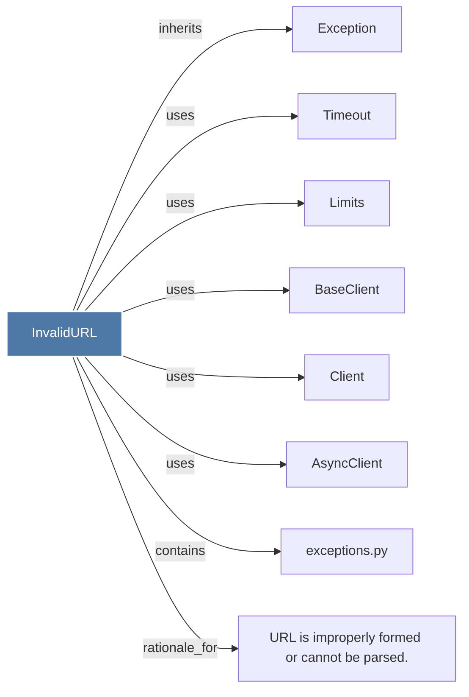

# InvalidURL

> [!info] Properties
> **File Type**: code
> **Community**: [[_COMMUNITY_Community None|Community None]]
> **Degree**: 8

## Architecture Graph


## Outbound Connections
- [[AsyncClient]] - `uses` [INFERRED]
- [[BaseClient]] - `uses` [INFERRED]
- [[Client]] - `uses` [INFERRED]
- [[Exception]] - `inherits` [EXTRACTED]
- [[Limits]] - `uses` [INFERRED]
- [[Timeout]] - `uses` [INFERRED]
- [[URL is improperly formed or cannot be parsed.]] - `rationale_for` [EXTRACTED]
- [[exceptions.py]] - `contains` [EXTRACTED]

## Inbound Dependencies
> [!abstract]- Files that link here
```dataview
LIST
FROM [[InvalidURL]]
```

#graphify/code #graphify/INFERRED #community/Community_None