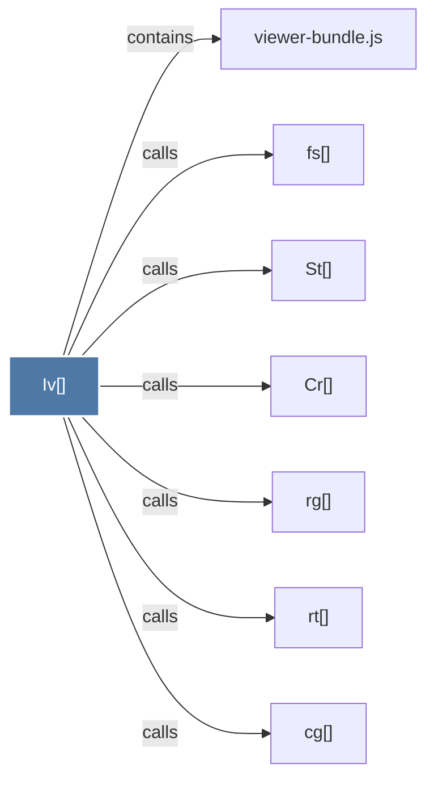

# Iv()

> [!info] Properties
> **File Type**: code
> **Community**: [[_COMMUNITY_Community None|Community None]]
> **Degree**: 7

## Architecture Graph


## Outbound Connections
- [[Cr()]] - `calls` [EXTRACTED]
- [[St()]] - `calls` [EXTRACTED]
- [[cg()]] - `calls` [EXTRACTED]
- [[fs()]] - `calls` [EXTRACTED]
- [[rg()]] - `calls` [EXTRACTED]
- [[rt()]] - `calls` [EXTRACTED]
- [[viewer-bundle.js]] - `contains` [EXTRACTED]

## Inbound Dependencies
> [!abstract]- Files that link here
```dataview
LIST
FROM [[Iv()]]
```

#graphify/code #graphify/EXTRACTED #community/Community_None