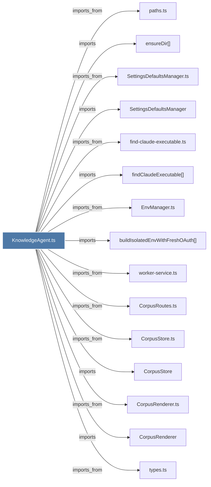

# KnowledgeAgent.ts

> [!info] Properties
> **File Type**: code
> **Community**: [[_COMMUNITY_Community None|Community None]]
> **Degree**: 20

## Architecture Graph


## Outbound Connections
- [[CorpusRenderer]] - `imports` [EXTRACTED]
- [[CorpusRenderer.ts]] - `imports_from` [EXTRACTED]
- [[CorpusRoutes.ts]] - `imports_from` [EXTRACTED]
- [[CorpusStore]] - `imports` [EXTRACTED]
- [[CorpusStore.ts]] - `imports_from` [EXTRACTED]
- [[EnvManager.ts]] - `imports_from` [EXTRACTED]
- [[KnowledgeAgent]] - `contains` [EXTRACTED]
- [[Logger]] - `imports` [EXTRACTED]
- [[SettingsDefaultsManager]] - `imports` [EXTRACTED]
- [[SettingsDefaultsManager.ts]] - `imports_from` [EXTRACTED]
- [[buildIsolatedEnvWithFreshOAuth()]] - `imports` [EXTRACTED]
- [[ensureDir()]] - `imports` [EXTRACTED]
- [[env-sanitizer.ts]] - `imports_from` [EXTRACTED]
- [[find-claude-executable.ts]] - `imports_from` [EXTRACTED]
- [[findClaudeExecutable()]] - `imports` [EXTRACTED]
- [[logger.ts]] - `imports_from` [EXTRACTED]
- [[paths.ts]] - `imports_from` [EXTRACTED]
- [[sanitizeEnv()]] - `imports` [EXTRACTED]
- [[types.ts_3]] - `imports_from` [EXTRACTED]
- [[worker-service.ts]] - `imports_from` [EXTRACTED]

## Inbound Dependencies
> [!abstract]- Files that link here
```dataview
LIST
FROM [[KnowledgeAgent.ts]]
```

#graphify/code #graphify/EXTRACTED #community/Community_None