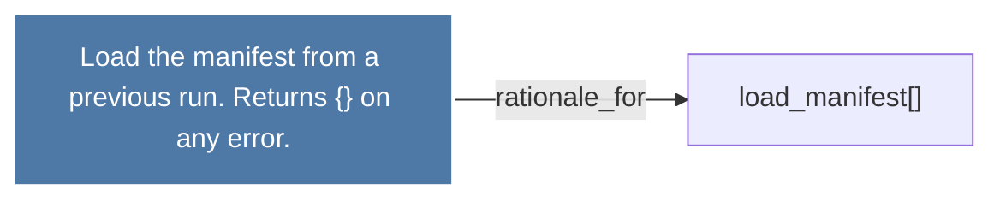

# Load the manifest from a previous run. Returns {} on any error.

> [!info] Properties
> **File Type**: rationale
> **Community**: [[_COMMUNITY_Community None|Community None]]
> **Degree**: 1

## Architecture Graph


## Outbound Connections
- [[load_manifest()]] - `rationale_for` [EXTRACTED]

## Inbound Dependencies
> [!abstract]- Files that link here
```dataview
LIST
FROM [[Load the manifest from a previous run. Returns {} on any error.]]
```

#graphify/rationale #graphify/EXTRACTED #community/Community_None