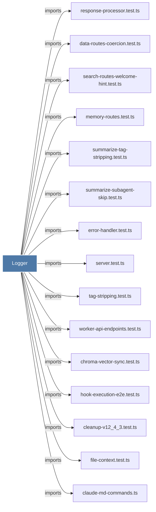

# Logger

> [!info] Properties
> **File Type**: code
> **Community**: [[_COMMUNITY_Community None|Community None]]
> **Degree**: 169

## Architecture Graph


## Outbound Connections
- [[.constructor()_47]] - `method` [EXTRACTED]
- [[.correlationId()]] - `method` [EXTRACTED]
- [[.dataIn()]] - `method` [EXTRACTED]
- [[.dataOut()]] - `method` [EXTRACTED]
- [[.debug()]] - `method` [EXTRACTED]
- [[.ensureLogFileInitialized()]] - `method` [EXTRACTED]
- [[.error()]] - `method` [EXTRACTED]
- [[.failure()]] - `method` [EXTRACTED]
- [[.formatData()]] - `method` [EXTRACTED]
- [[.formatTimestamp()]] - `method` [EXTRACTED]
- [[.formatTool()]] - `method` [EXTRACTED]
- [[.getLevel()]] - `method` [EXTRACTED]
- [[.happyPathError()]] - `method` [EXTRACTED]
- [[.info()]] - `method` [EXTRACTED]
- [[.log()_1]] - `method` [EXTRACTED]
- [[.sessionId()]] - `method` [EXTRACTED]
- [[.success()]] - `method` [EXTRACTED]
- [[.timing()]] - `method` [EXTRACTED]
- [[.warn()]] - `method` [EXTRACTED]
- [[BaseRouteHandler.ts]] - `imports` [EXTRACTED]
- [[BranchManager.ts]] - `imports` [EXTRACTED]
- [[ChromaMcpManager.ts]] - `imports` [EXTRACTED]
- [[ChromaRoutes.ts]] - `imports` [EXTRACTED]
- [[ChromaSearchStrategy.ts]] - `imports` [EXTRACTED]
- [[ChromaSync.ts]] - `imports` [EXTRACTED]
- [[ChromaSyncState.ts]] - `imports` [EXTRACTED]
- [[ClaudeProvider.ts]] - `imports` [EXTRACTED]
- [[CleanupV12_4_3.ts]] - `imports` [EXTRACTED]
- [[CodexCliInstaller.ts]] - `imports` [EXTRACTED]
- [[ContextBuilder.ts]] - `imports` [EXTRACTED]
- [[CorpusBuilder.ts]] - `imports` [EXTRACTED]
- [[CorpusStore.ts]] - `imports` [EXTRACTED]
- [[CursorHooksInstaller.ts]] - `imports` [EXTRACTED]
- [[DataRoutes.ts]] - `imports` [EXTRACTED]
- [[Database.ts]] - `imports` [EXTRACTED]
- [[DatabaseManager.ts]] - `imports` [EXTRACTED]
- [[DateFilter.ts]] - `imports` [EXTRACTED]
- [[EnvManager.ts]] - `imports` [EXTRACTED]
- [[ErrorHandler.ts]] - `imports` [EXTRACTED]
- [[FallbackErrorHandler.ts]] - `imports` [EXTRACTED]
- [[FormattingService.ts]] - `imports` [EXTRACTED]
- [[GeminiCliHooksInstaller.ts]] - `imports` [EXTRACTED]
- [[GeminiProvider.ts]] - `imports` [EXTRACTED]
- [[GeneratorExitHandler.ts]] - `imports` [EXTRACTED]
- [[GracefulShutdown.ts]] - `imports` [EXTRACTED]
- [[HealthMonitor.ts]] - `imports` [EXTRACTED]
- [[HybridSearchStrategy.ts]] - `imports` [EXTRACTED]
- [[Import.ts]] - `imports` [EXTRACTED]
- [[KnowledgeAgent.ts]] - `imports` [EXTRACTED]
- [[LogsRoutes.ts]] - `imports` [EXTRACTED]
- [[McpIntegrations.ts]] - `imports` [EXTRACTED]
- [[MemoryRoutes.ts]] - `imports` [EXTRACTED]
- [[ModeManager.ts]] - `imports` [EXTRACTED]
- [[ObservationBroadcaster.ts]] - `imports` [EXTRACTED]
- [[ObservationCompiler.ts]] - `imports` [EXTRACTED]
- [[Observations.ts]] - `imports` [EXTRACTED]
- [[OpenClawInstaller.ts]] - `imports` [EXTRACTED]
- [[OpenCodeInstaller.ts]] - `imports` [EXTRACTED]
- [[OpenRouterProvider.ts]] - `imports` [EXTRACTED]
- [[PaginationHelper.ts]] - `imports` [EXTRACTED]
- [[PendingMessageStore.ts]] - `imports` [EXTRACTED]
- [[PrivacyCheckValidator.ts]] - `imports` [EXTRACTED]
- [[ProcessManager.ts]] - `imports` [EXTRACTED]
- [[ProjectFilter.ts]] - `imports` [EXTRACTED]
- [[Prompts.ts]] - `imports` [EXTRACTED]
- [[ResponseProcessor.ts]] - `imports` [EXTRACTED]
- [[ResultFormatter.ts]] - `imports` [EXTRACTED]
- [[SQLiteSearchStrategy.ts]] - `imports` [EXTRACTED]
- [[SSEBroadcaster.ts]] - `imports` [EXTRACTED]
- [[SearchManager.ts]] - `imports` [EXTRACTED]
- [[SearchOrchestrator.ts]] - `imports` [EXTRACTED]
- [[SearchRoutes.ts]] - `imports` [EXTRACTED]
- [[SearchStrategy.ts]] - `imports` [EXTRACTED]
- [[Server.ts]] - `imports` [EXTRACTED]
- [[SessionCleanupHelper.ts]] - `imports` [EXTRACTED]
- [[SessionCompletionHandler.ts]] - `imports` [EXTRACTED]
- [[SessionManager.ts]] - `imports` [EXTRACTED]
- [[SessionQueueProcessor.ts]] - `imports` [EXTRACTED]
- [[SessionRoutes.ts]] - `imports` [EXTRACTED]
- [[SessionSearch.ts]] - `imports` [EXTRACTED]
- [[SessionStore.ts]] - `imports` [EXTRACTED]
- [[Sessions.ts]] - `imports` [EXTRACTED]
- [[SettingsManager.ts]] - `imports` [EXTRACTED]
- [[SettingsRoutes.ts]] - `imports` [EXTRACTED]
- [[Summaries.ts]] - `imports` [EXTRACTED]
- [[TelegramNotifier.ts]] - `imports` [EXTRACTED]
- [[Timeline.ts]] - `imports` [EXTRACTED]
- [[TimelineBuilder.ts]] - `imports` [EXTRACTED]
- [[TimelineService.ts]] - `imports` [EXTRACTED]
- [[TypeFilter.ts]] - `imports` [EXTRACTED]
- [[ViewerRoutes.ts]] - `imports` [EXTRACTED]
- [[WindsurfHooksInstaller.ts]] - `imports` [EXTRACTED]
- [[WorktreeAdoption.ts]] - `imports` [EXTRACTED]
- [[agents-md-utils.ts]] - `imports` [EXTRACTED]
- [[bulk.ts]] - `imports` [EXTRACTED]
- [[chroma-vector-sync.test.ts]] - `imports` [EXTRACTED]
- [[claude-md-commands.ts]] - `imports` [EXTRACTED]
- [[claude-md-utils.ts]] - `imports` [EXTRACTED]
- [[cleanup-v12_4_3.test.ts]] - `imports` [EXTRACTED]
- [[context-generator.ts]] - `imports` [EXTRACTED]
- [[context.ts]] - `imports` [EXTRACTED]
- [[create.ts]] - `imports` [EXTRACTED]
- [[cursor-utils.ts]] - `imports` [EXTRACTED]
- [[data-routes-coercion.test.ts]] - `imports` [EXTRACTED]
- [[error-handler.test.ts]] - `imports` [EXTRACTED]
- [[field-utils.ts]] - `imports` [EXTRACTED]
- [[file-context.test.ts]] - `imports` [EXTRACTED]
- [[file-context.ts]] - `imports` [EXTRACTED]
- [[file-edit.ts]] - `imports` [EXTRACTED]
- [[files.ts]] - `imports` [EXTRACTED]
- [[find-claude-executable.ts]] - `imports` [EXTRACTED]
- [[get.ts]] - `imports` [EXTRACTED]
- [[get.ts_1]] - `imports` [EXTRACTED]
- [[get.ts_2]] - `imports` [EXTRACTED]
- [[get.ts_3]] - `imports` [EXTRACTED]
- [[health-checker.ts]] - `imports` [EXTRACTED]
- [[hook-command.ts]] - `imports` [EXTRACTED]
- [[hook-execution-e2e.test.ts]] - `imports` [EXTRACTED]
- [[import-xml-observations.ts]] - `imports` [EXTRACTED]
- [[index.ts_2]] - `imports` [EXTRACTED]
- [[index.ts_11]] - `imports` [EXTRACTED]
- [[json-utils.ts]] - `imports` [EXTRACTED]
- [[logger.ts]] - `contains` [EXTRACTED]
- [[mcp-server.ts]] - `imports` [EXTRACTED]
- [[memory-routes.test.ts]] - `imports` [EXTRACTED]
- [[middleware.ts]] - `imports` [EXTRACTED]
- [[migrations.ts]] - `imports` [EXTRACTED]
- [[observation.ts]] - `imports` [EXTRACTED]
- [[parser.ts]] - `imports` [EXTRACTED]
- [[parser.ts_1]] - `imports` [EXTRACTED]
- [[paths.ts]] - `imports` [EXTRACTED]
- [[process-registry.ts]] - `imports` [EXTRACTED]
- [[processor.ts]] - `imports` [EXTRACTED]
- [[project-name.ts]] - `imports` [EXTRACTED]
- [[prompts.ts]] - `imports` [EXTRACTED]
- [[queries.ts]] - `imports` [EXTRACTED]
- [[recent.ts]] - `imports` [EXTRACTED]
- [[recent.ts_1]] - `imports` [EXTRACTED]
- [[response-processor.test.ts]] - `imports` [EXTRACTED]
- [[retry.ts]] - `imports` [EXTRACTED]
- [[runner.ts]] - `imports` [EXTRACTED]
- [[search-routes-welcome-hint.test.ts]] - `imports` [EXTRACTED]
- [[search.ts]] - `imports` [EXTRACTED]
- [[server.test.ts]] - `imports` [EXTRACTED]
- [[session-init.ts]] - `imports` [EXTRACTED]
- [[shared.ts]] - `imports` [EXTRACTED]
- [[shutdown.ts]] - `imports` [EXTRACTED]
- [[state.ts]] - `imports` [EXTRACTED]
- [[stdin-reader.ts]] - `imports` [EXTRACTED]
- [[store.ts]] - `imports` [EXTRACTED]
- [[store.ts_1]] - `imports` [EXTRACTED]
- [[store.ts_2]] - `imports` [EXTRACTED]
- [[summarize-subagent-skip.test.ts]] - `imports` [EXTRACTED]
- [[summarize-tag-stripping.test.ts]] - `imports` [EXTRACTED]
- [[summarize.ts]] - `imports` [EXTRACTED]
- [[tag-stripping.test.ts]] - `imports` [EXTRACTED]
- [[tag-stripping.ts]] - `imports` [EXTRACTED]
- [[timeline-formatting.ts]] - `imports` [EXTRACTED]
- [[transactions.ts]] - `imports` [EXTRACTED]
- [[transcript-parser.ts]] - `imports` [EXTRACTED]
- [[types.ts_7]] - `imports` [EXTRACTED]
- [[types.ts_8]] - `imports` [EXTRACTED]
- [[types.ts_9]] - `imports` [EXTRACTED]
- [[types.ts_10]] - `imports` [EXTRACTED]
- [[watcher.ts]] - `imports` [EXTRACTED]
- [[worker-api-endpoints.test.ts]] - `imports` [EXTRACTED]
- [[worker-service.ts]] - `imports` [EXTRACTED]
- [[worker-spawner.ts]] - `imports` [EXTRACTED]
- [[worker-utils.ts]] - `imports` [EXTRACTED]

## Inbound Dependencies
> [!abstract]- Files that link here
```dataview
LIST
FROM [[Logger]]
```

#graphify/code #graphify/EXTRACTED #community/Community_None