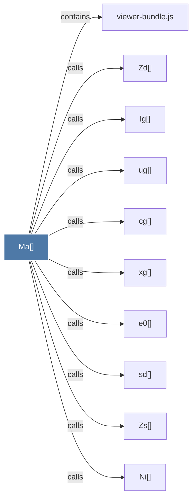

# Ma()

> [!info] Properties
> **File Type**: code
> **Community**: [[_COMMUNITY_Community None|Community None]]
> **Degree**: 10

## Architecture Graph


## Outbound Connections
- [[Ni()]] - `calls` [EXTRACTED]
- [[Zd()]] - `calls` [EXTRACTED]
- [[Zs()]] - `calls` [EXTRACTED]
- [[cg()]] - `calls` [EXTRACTED]
- [[e0()]] - `calls` [EXTRACTED]
- [[lg()]] - `calls` [EXTRACTED]
- [[sd()]] - `calls` [EXTRACTED]
- [[ug()]] - `calls` [EXTRACTED]
- [[viewer-bundle.js]] - `contains` [EXTRACTED]
- [[xg()]] - `calls` [EXTRACTED]

## Inbound Dependencies
> [!abstract]- Files that link here
```dataview
LIST
FROM [[Ma()]]
```

#graphify/code #graphify/EXTRACTED #community/Community_None