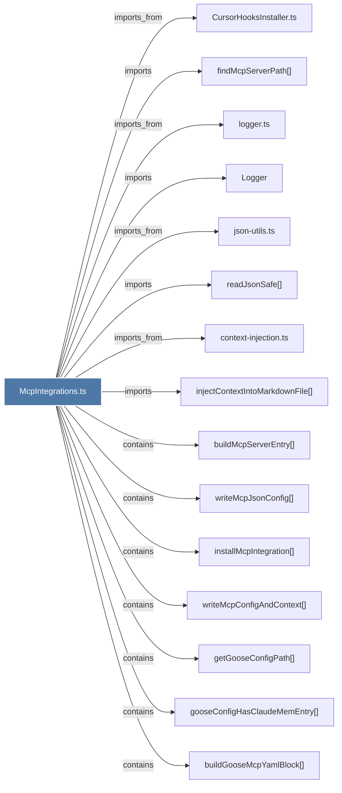

# McpIntegrations.ts

> [!info] Properties
> **File Type**: code
> **Community**: [[_COMMUNITY_Community None|Community None]]
> **Degree**: 18

## Architecture Graph


## Outbound Connections
- [[CursorHooksInstaller.ts]] - `imports_from` [EXTRACTED]
- [[Logger]] - `imports` [EXTRACTED]
- [[buildGooseClaudeMemEntryYaml()]] - `contains` [EXTRACTED]
- [[buildGooseMcpYamlBlock()]] - `contains` [EXTRACTED]
- [[buildMcpServerEntry()_1]] - `contains` [EXTRACTED]
- [[context-injection.ts]] - `imports_from` [EXTRACTED]
- [[findMcpServerPath()]] - `imports` [EXTRACTED]
- [[getGooseConfigPath()]] - `contains` [EXTRACTED]
- [[gooseConfigHasClaudeMemEntry()]] - `contains` [EXTRACTED]
- [[injectContextIntoMarkdownFile()]] - `imports` [EXTRACTED]
- [[installGooseMcpIntegration()]] - `contains` [EXTRACTED]
- [[installMcpIntegration()]] - `contains` [EXTRACTED]
- [[json-utils.ts]] - `imports_from` [EXTRACTED]
- [[logger.ts]] - `imports_from` [EXTRACTED]
- [[mergeGooseYamlConfig()]] - `contains` [EXTRACTED]
- [[readJsonSafe()]] - `imports` [EXTRACTED]
- [[writeMcpConfigAndContext()]] - `contains` [EXTRACTED]
- [[writeMcpJsonConfig()_1]] - `contains` [EXTRACTED]

## Inbound Dependencies
> [!abstract]- Files that link here
```dataview
LIST
FROM [[McpIntegrations.ts]]
```

#graphify/code #graphify/EXTRACTED #community/Community_None