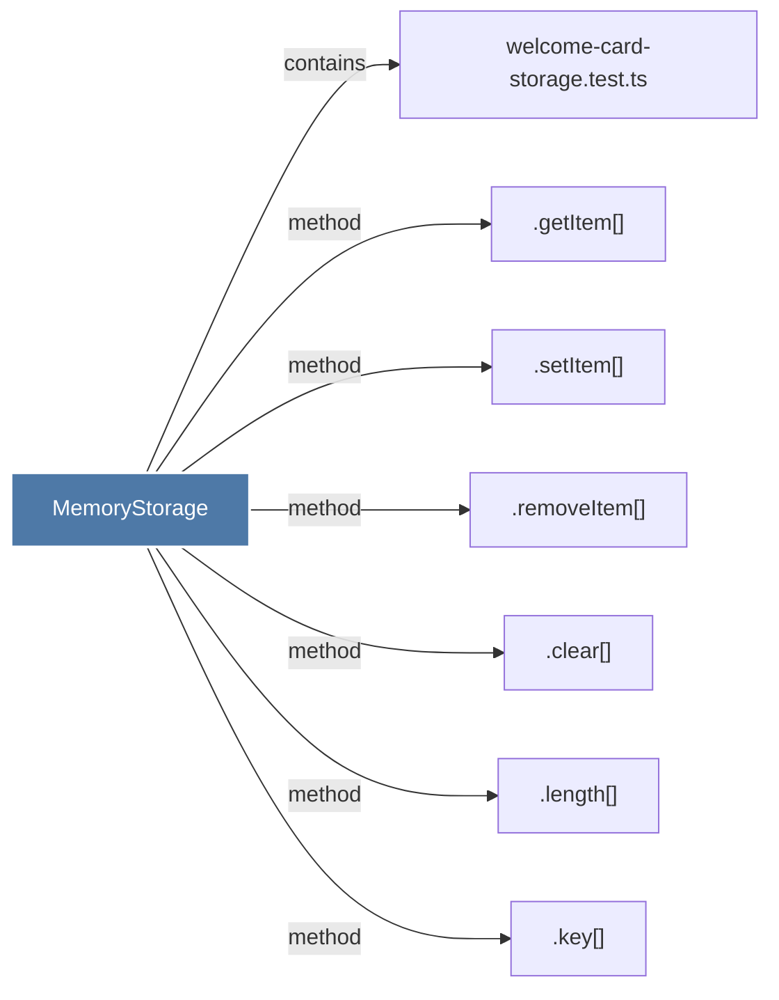

# MemoryStorage

> [!info] Properties
> **File Type**: code
> **Community**: [[_COMMUNITY_Community None|Community None]]
> **Degree**: 7

## Architecture Graph


## Outbound Connections
- [[.clear()_1]] - `method` [EXTRACTED]
- [[.getItem()]] - `method` [EXTRACTED]
- [[.key()]] - `method` [EXTRACTED]
- [[.length()]] - `method` [EXTRACTED]
- [[.removeItem()]] - `method` [EXTRACTED]
- [[.setItem()]] - `method` [EXTRACTED]
- [[welcome-card-storage.test.ts]] - `contains` [EXTRACTED]

## Inbound Dependencies
> [!abstract]- Files that link here
```dataview
LIST
FROM [[MemoryStorage]]
```

#graphify/code #graphify/EXTRACTED #community/Community_None