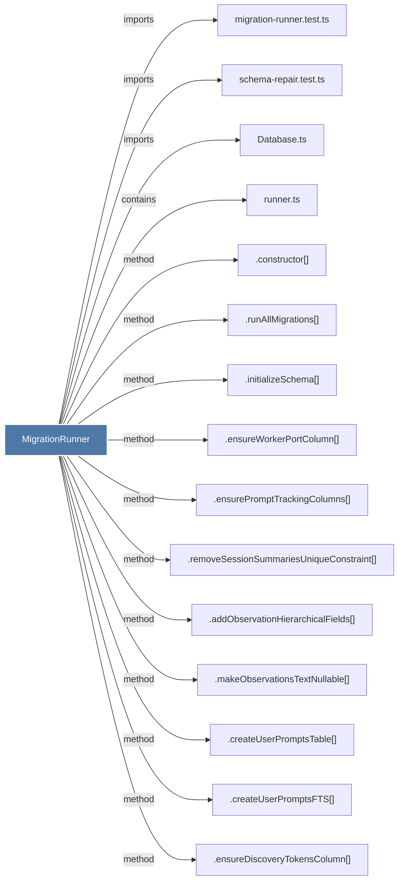

# MigrationRunner

> [!info] Properties
> **File Type**: code
> **Community**: [[_COMMUNITY_Community None|Community None]]
> **Degree**: 31

## Architecture Graph


## Outbound Connections
- [[.addFailedAtEpochColumn()_1]] - `method` [EXTRACTED]
- [[.addObservationContentHashColumn()_1]] - `method` [EXTRACTED]
- [[.addObservationHierarchicalFields()_1]] - `method` [EXTRACTED]
- [[.addObservationSubagentColumns()_1]] - `method` [EXTRACTED]
- [[.addObservationsMetadataColumn()_1]] - `method` [EXTRACTED]
- [[.addObservationsUniqueContentHashIndex()_1]] - `method` [EXTRACTED]
- [[.addOnUpdateCascadeToForeignKeys()_1]] - `method` [EXTRACTED]
- [[.addSessionCustomTitleColumn()_1]] - `method` [EXTRACTED]
- [[.addSessionPlatformSourceColumn()_1]] - `method` [EXTRACTED]
- [[.constructor()_39]] - `method` [EXTRACTED]
- [[.createObservationFeedbackTable()]] - `method` [EXTRACTED]
- [[.createPendingMessagesTable()_1]] - `method` [EXTRACTED]
- [[.createUserPromptsFTS()]] - `method` [EXTRACTED]
- [[.createUserPromptsTable()_1]] - `method` [EXTRACTED]
- [[.dropDeadPendingMessagesColumns()_1]] - `method` [EXTRACTED]
- [[.ensureDiscoveryTokensColumn()_1]] - `method` [EXTRACTED]
- [[.ensureMergedIntoProjectColumns()_1]] - `method` [EXTRACTED]
- [[.ensurePromptTrackingColumns()_1]] - `method` [EXTRACTED]
- [[.ensureWorkerPortColumn()_1]] - `method` [EXTRACTED]
- [[.initializeSchema()_1]] - `method` [EXTRACTED]
- [[.makeObservationsTextNullable()_1]] - `method` [EXTRACTED]
- [[.rebuildPendingMessagesForSelfHealingClaim()]] - `method` [EXTRACTED]
- [[.recreateObservationsWithUpdateCascade()]] - `method` [EXTRACTED]
- [[.recreateSessionSummariesWithUpdateCascade()]] - `method` [EXTRACTED]
- [[.removeSessionSummariesUniqueConstraint()_1]] - `method` [EXTRACTED]
- [[.renameSessionIdColumns()_1]] - `method` [EXTRACTED]
- [[.runAllMigrations()]] - `method` [EXTRACTED]
- [[Database.ts]] - `imports` [EXTRACTED]
- [[migration-runner.test.ts]] - `imports` [EXTRACTED]
- [[runner.ts]] - `contains` [EXTRACTED]
- [[schema-repair.test.ts]] - `imports` [EXTRACTED]

## Inbound Dependencies
> [!abstract]- Files that link here
```dataview
LIST
FROM [[MigrationRunner]]
```

#graphify/code #graphify/EXTRACTED #community/Community_None