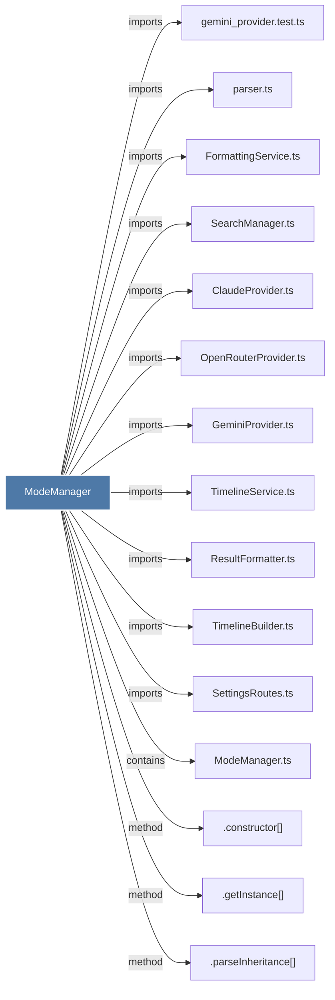

# ModeManager

> [!info] Properties
> **File Type**: code
> **Community**: [[_COMMUNITY_Community None|Community None]]
> **Degree**: 29

## Architecture Graph


## Outbound Connections
- [[.constructor()_34]] - `method` [EXTRACTED]
- [[.deepMerge()]] - `method` [EXTRACTED]
- [[.getActiveMode()]] - `method` [EXTRACTED]
- [[.getInstance()]] - `method` [EXTRACTED]
- [[.getObservationConcepts()]] - `method` [EXTRACTED]
- [[.getObservationTypes()]] - `method` [EXTRACTED]
- [[.getTypeIcon()_1]] - `method` [EXTRACTED]
- [[.getTypeLabel()]] - `method` [EXTRACTED]
- [[.getWorkEmoji()]] - `method` [EXTRACTED]
- [[.isPlainObject()]] - `method` [EXTRACTED]
- [[.loadMode()]] - `method` [EXTRACTED]
- [[.loadModeFile()]] - `method` [EXTRACTED]
- [[.parseInheritance()]] - `method` [EXTRACTED]
- [[.validateType()]] - `method` [EXTRACTED]
- [[AgentFormatter.ts]] - `imports` [EXTRACTED]
- [[ClaudeProvider.ts]] - `imports` [EXTRACTED]
- [[ContextConfigLoader.ts]] - `imports` [EXTRACTED]
- [[FormattingService.ts]] - `imports` [EXTRACTED]
- [[GeminiProvider.ts]] - `imports` [EXTRACTED]
- [[HumanFormatter.ts]] - `imports` [EXTRACTED]
- [[ModeManager.ts]] - `contains` [EXTRACTED]
- [[OpenRouterProvider.ts]] - `imports` [EXTRACTED]
- [[ResultFormatter.ts]] - `imports` [EXTRACTED]
- [[SearchManager.ts]] - `imports` [EXTRACTED]
- [[SettingsRoutes.ts]] - `imports` [EXTRACTED]
- [[TimelineBuilder.ts]] - `imports` [EXTRACTED]
- [[TimelineService.ts]] - `imports` [EXTRACTED]
- [[gemini_provider.test.ts]] - `imports` [EXTRACTED]
- [[parser.ts]] - `imports` [EXTRACTED]

## Inbound Dependencies
> [!abstract]- Files that link here
```dataview
LIST
FROM [[ModeManager]]
```

#graphify/code #graphify/EXTRACTED #community/Community_None