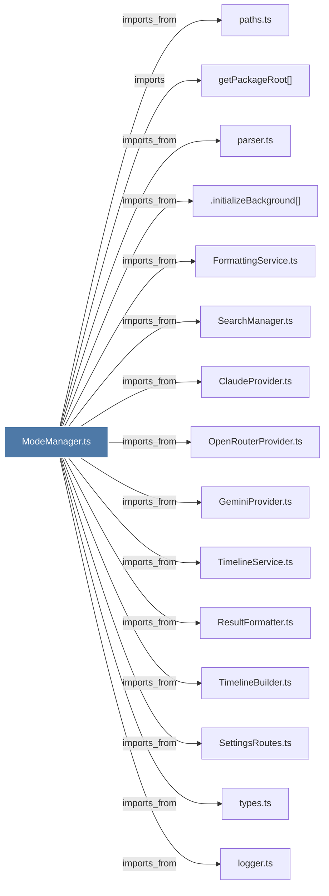

# ModeManager.ts

> [!info] Properties
> **File Type**: code
> **Community**: [[_COMMUNITY_Community None|Community None]]
> **Degree**: 20

## Architecture Graph


## Outbound Connections
- [[.initializeBackground()]] - `imports_from` [EXTRACTED]
- [[AgentFormatter.ts]] - `imports_from` [EXTRACTED]
- [[ClaudeProvider.ts]] - `imports_from` [EXTRACTED]
- [[ContextConfigLoader.ts]] - `imports_from` [EXTRACTED]
- [[FormattingService.ts]] - `imports_from` [EXTRACTED]
- [[GeminiProvider.ts]] - `imports_from` [EXTRACTED]
- [[HumanFormatter.ts]] - `imports_from` [EXTRACTED]
- [[Logger]] - `imports` [EXTRACTED]
- [[ModeManager]] - `contains` [EXTRACTED]
- [[OpenRouterProvider.ts]] - `imports_from` [EXTRACTED]
- [[ResultFormatter.ts]] - `imports_from` [EXTRACTED]
- [[SearchManager.ts]] - `imports_from` [EXTRACTED]
- [[SettingsRoutes.ts]] - `imports_from` [EXTRACTED]
- [[TimelineBuilder.ts]] - `imports_from` [EXTRACTED]
- [[TimelineService.ts]] - `imports_from` [EXTRACTED]
- [[getPackageRoot()]] - `imports` [EXTRACTED]
- [[logger.ts]] - `imports_from` [EXTRACTED]
- [[parser.ts]] - `imports_from` [EXTRACTED]
- [[paths.ts]] - `imports_from` [EXTRACTED]
- [[types.ts_5]] - `imports_from` [EXTRACTED]

## Inbound Dependencies
> [!abstract]- Files that link here
```dataview
LIST
FROM [[ModeManager.ts]]
```

#graphify/code #graphify/EXTRACTED #community/Community_None