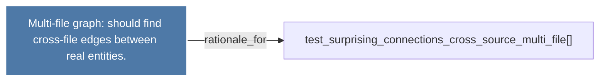

# Multi-file graph: should find cross-file edges between real entities.

> [!info] Properties
> **File Type**: rationale
> **Community**: [[_COMMUNITY_Community None|Community None]]
> **Degree**: 1

## Architecture Graph


## Outbound Connections
- [[test_surprising_connections_cross_source_multi_file()]] - `rationale_for` [EXTRACTED]

## Inbound Dependencies
> [!abstract]- Files that link here
```dataview
LIST
FROM [[Multi-file graph should find cross-file edges between real entities.]]
```

#graphify/rationale #graphify/EXTRACTED #community/Community_None