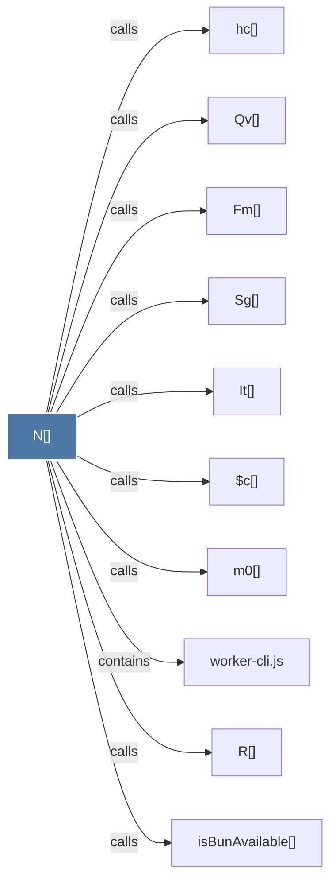

# N()

> [!info] Properties
> **File Type**: code
> **Community**: [[_COMMUNITY_Community None|Community None]]
> **Degree**: 10

## Architecture Graph


## Outbound Connections
- [[$c()]] - `calls` [INFERRED]
- [[Fm()]] - `calls` [INFERRED]
- [[It()]] - `calls` [INFERRED]
- [[Qv()]] - `calls` [INFERRED]
- [[R()]] - `calls` [EXTRACTED]
- [[Sg()]] - `calls` [INFERRED]
- [[hc()]] - `calls` [INFERRED]
- [[isBunAvailable()]] - `calls` [EXTRACTED]
- [[m0()]] - `calls` [INFERRED]
- [[worker-cli.js]] - `contains` [EXTRACTED]

## Inbound Dependencies
> [!abstract]- Files that link here
```dataview
LIST
FROM [[N()]]
```

#graphify/code #graphify/INFERRED #community/Community_None