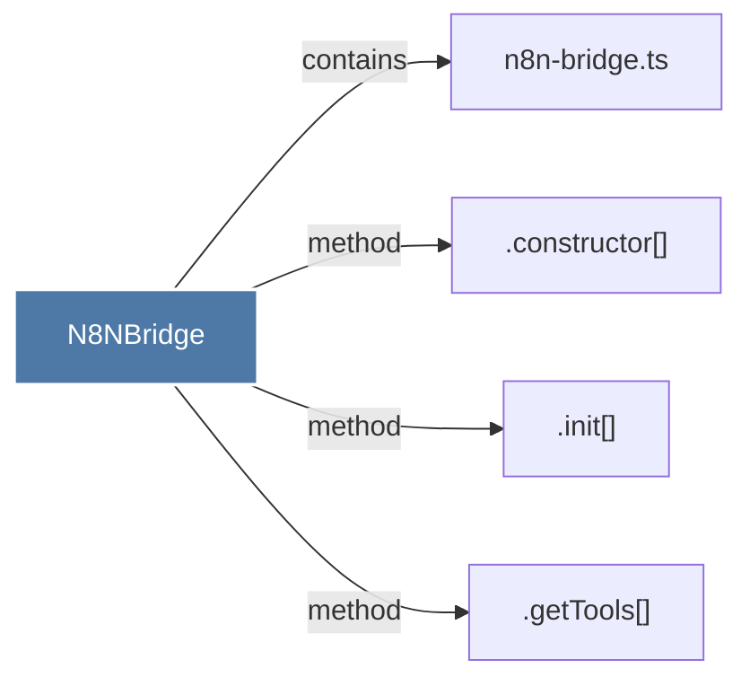

# N8NBridge

> [!info] Properties
> **File Type**: code
> **Community**: [[_COMMUNITY_Community None|Community None]]
> **Degree**: 4

## Architecture Graph


## Outbound Connections
- [[.constructor()_49]] - `method` [EXTRACTED]
- [[.getTools()]] - `method` [EXTRACTED]
- [[.init()_1]] - `method` [EXTRACTED]
- [[n8n-bridge.ts]] - `contains` [EXTRACTED]

## Inbound Dependencies
> [!abstract]- Files that link here
```dataview
LIST
FROM [[N8NBridge]]
```

#graphify/code #graphify/EXTRACTED #community/Community_None