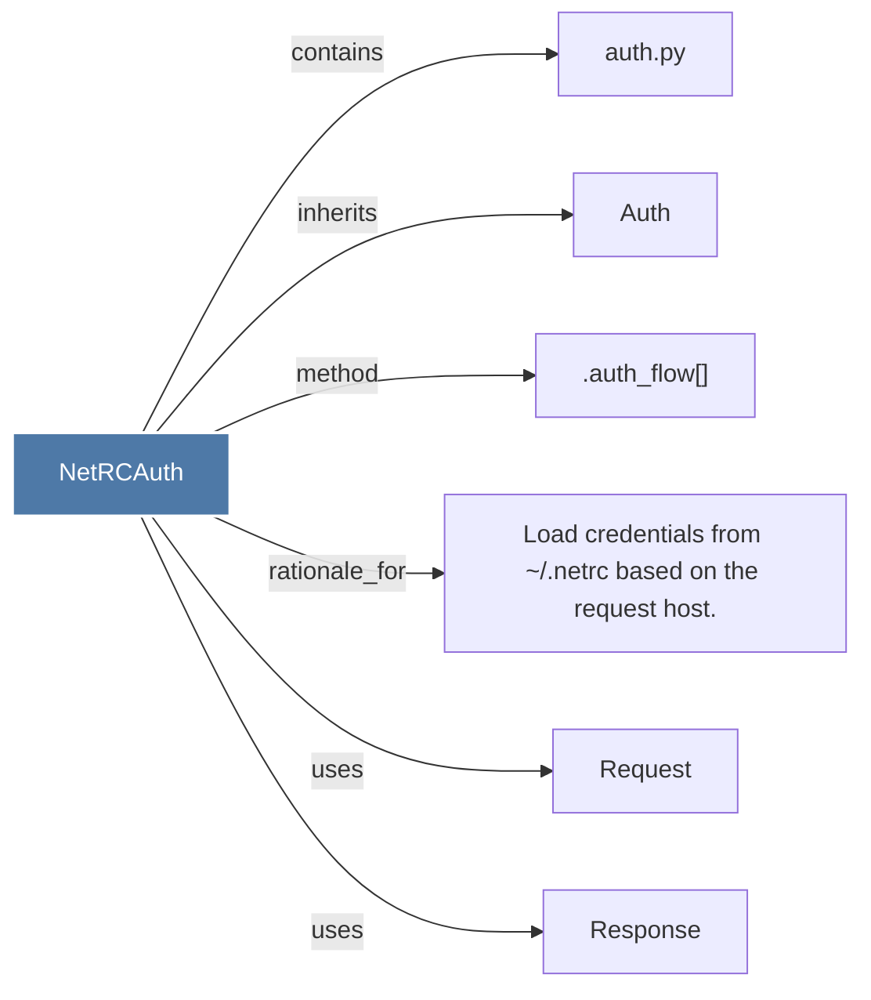

# NetRCAuth

> [!info] Properties
> **File Type**: code
> **Community**: [[_COMMUNITY_Community None|Community None]]
> **Degree**: 6

## Architecture Graph


## Outbound Connections
- [[.auth_flow()_4]] - `method` [EXTRACTED]
- [[Auth]] - `inherits` [EXTRACTED]
- [[Load credentials from ~.netrc based on the request host.]] - `rationale_for` [EXTRACTED]
- [[Request]] - `uses` [INFERRED]
- [[Response]] - `uses` [INFERRED]
- [[auth.py]] - `contains` [EXTRACTED]

## Inbound Dependencies
> [!abstract]- Files that link here
```dataview
LIST
FROM [[NetRCAuth]]
```

#graphify/code #graphify/EXTRACTED #community/Community_None