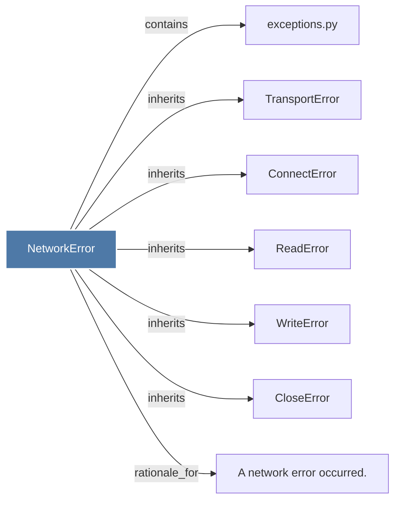

# NetworkError

> [!info] Properties
> **File Type**: code
> **Community**: [[_COMMUNITY_Community None|Community None]]
> **Degree**: 7

## Architecture Graph


## Outbound Connections
- [[A network error occurred.]] - `rationale_for` [EXTRACTED]
- [[CloseError]] - `inherits` [EXTRACTED]
- [[ConnectError]] - `inherits` [EXTRACTED]
- [[ReadError]] - `inherits` [EXTRACTED]
- [[TransportError]] - `inherits` [EXTRACTED]
- [[WriteError]] - `inherits` [EXTRACTED]
- [[exceptions.py]] - `contains` [EXTRACTED]

## Inbound Dependencies
> [!abstract]- Files that link here
```dataview
LIST
FROM [[NetworkError_1]]
```

#graphify/code #graphify/EXTRACTED #community/Community_None