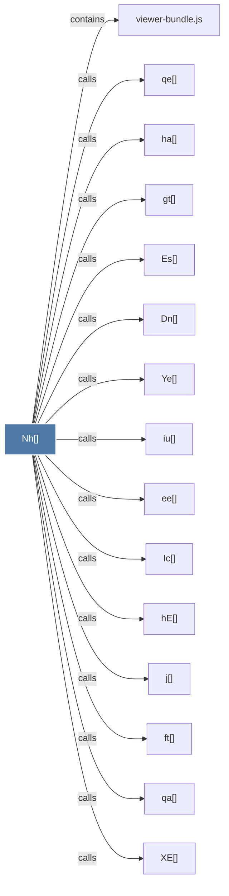

# Nh()

> [!info] Properties
> **File Type**: code
> **Community**: [[_COMMUNITY_Community None|Community None]]
> **Degree**: 19

## Architecture Graph


## Outbound Connections
- [[Dn()]] - `calls` [EXTRACTED]
- [[Es()]] - `calls` [EXTRACTED]
- [[Gh()]] - `calls` [EXTRACTED]
- [[Ic()]] - `calls` [EXTRACTED]
- [[XE()]] - `calls` [EXTRACTED]
- [[Ye()]] - `calls` [EXTRACTED]
- [[cf()]] - `calls` [EXTRACTED]
- [[createHTML()]] - `calls` [EXTRACTED]
- [[createScriptURL()]] - `calls` [EXTRACTED]
- [[ee()]] - `calls` [EXTRACTED]
- [[ft()]] - `calls` [EXTRACTED]
- [[gt()]] - `calls` [EXTRACTED]
- [[hE()]] - `calls` [EXTRACTED]
- [[ha()]] - `calls` [EXTRACTED]
- [[iu()]] - `calls` [EXTRACTED]
- [[j()]] - `calls` [EXTRACTED]
- [[qa()]] - `calls` [EXTRACTED]
- [[qe()]] - `calls` [EXTRACTED]
- [[viewer-bundle.js]] - `contains` [EXTRACTED]

## Inbound Dependencies
> [!abstract]- Files that link here
```dataview
LIST
FROM [[Nh()]]
```

#graphify/code #graphify/EXTRACTED #community/Community_None