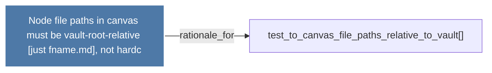

# Node file paths in canvas must be vault-root-relative (just fname.md), not hardc

> [!info] Properties
> **File Type**: rationale
> **Community**: [[_COMMUNITY_Community None|Community None]]
> **Degree**: 1

## Architecture Graph


## Outbound Connections
- [[test_to_canvas_file_paths_relative_to_vault()]] - `rationale_for` [EXTRACTED]

## Inbound Dependencies
> [!abstract]- Files that link here
```dataview
LIST
FROM [[Node file paths in canvas must be vault-root-relative (just fname.md), not hardc]]
```

#graphify/rationale #graphify/EXTRACTED #community/Community_None