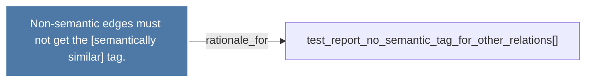

# Non-semantic edges must not get the [semantically similar] tag.

> [!info] Properties
> **File Type**: rationale
> **Community**: [[_COMMUNITY_Community None|Community None]]
> **Degree**: 1

## Architecture Graph


## Outbound Connections
- [[test_report_no_semantic_tag_for_other_relations()]] - `rationale_for` [EXTRACTED]

## Inbound Dependencies
> [!abstract]- Files that link here
```dataview
LIST
FROM [[Non-semantic edges must not get the semantically similar tag.]]
```

#graphify/rationale #graphify/EXTRACTED #community/Community_None