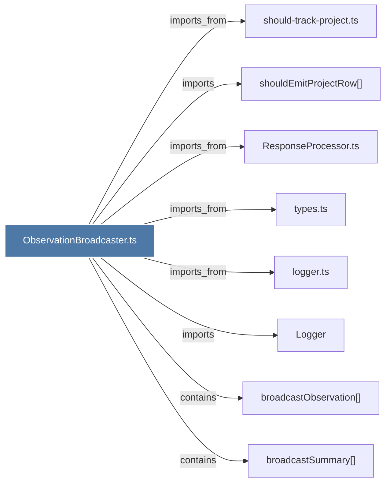

# ObservationBroadcaster.ts

> [!info] Properties
> **File Type**: code
> **Community**: [[_COMMUNITY_Community None|Community None]]
> **Degree**: 8

## Architecture Graph


## Outbound Connections
- [[Logger]] - `imports` [EXTRACTED]
- [[ResponseProcessor.ts]] - `imports_from` [EXTRACTED]
- [[broadcastObservation()]] - `contains` [EXTRACTED]
- [[broadcastSummary()]] - `contains` [EXTRACTED]
- [[logger.ts]] - `imports_from` [EXTRACTED]
- [[should-track-project.ts]] - `imports_from` [EXTRACTED]
- [[shouldEmitProjectRow()]] - `imports` [EXTRACTED]
- [[types.ts_1]] - `imports_from` [EXTRACTED]

## Inbound Dependencies
> [!abstract]- Files that link here
```dataview
LIST
FROM [[ObservationBroadcaster.ts]]
```

#graphify/code #graphify/EXTRACTED #community/Community_None