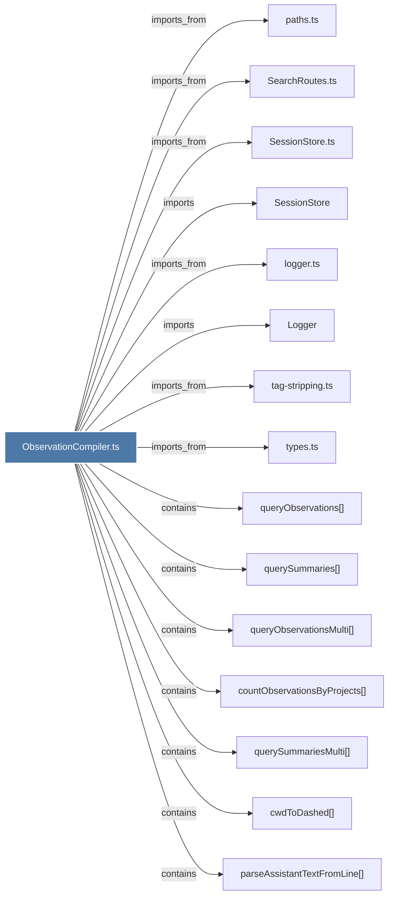

# ObservationCompiler.ts

> [!info] Properties
> **File Type**: code
> **Community**: [[_COMMUNITY_Community None|Community None]]
> **Degree**: 22

## Architecture Graph


## Outbound Connections
- [[ContextBuilder.ts]] - `imports_from` [EXTRACTED]
- [[Logger]] - `imports` [EXTRACTED]
- [[SearchRoutes.ts]] - `imports_from` [EXTRACTED]
- [[SessionStore]] - `imports` [EXTRACTED]
- [[SessionStore.ts]] - `imports_from` [EXTRACTED]
- [[buildTimeline()]] - `contains` [EXTRACTED]
- [[countObservationsByProjects()]] - `contains` [EXTRACTED]
- [[cwdToDashed()]] - `contains` [EXTRACTED]
- [[extractPriorMessages()]] - `contains` [EXTRACTED]
- [[findLastAssistantMessage()]] - `contains` [EXTRACTED]
- [[getFullObservationIds()]] - `contains` [EXTRACTED]
- [[getPriorSessionMessages()]] - `contains` [EXTRACTED]
- [[logger.ts]] - `imports_from` [EXTRACTED]
- [[parseAssistantTextFromLine()]] - `contains` [EXTRACTED]
- [[paths.ts]] - `imports_from` [EXTRACTED]
- [[prepareSummariesForTimeline()]] - `contains` [EXTRACTED]
- [[queryObservations()]] - `contains` [EXTRACTED]
- [[queryObservationsMulti()]] - `contains` [EXTRACTED]
- [[querySummaries()]] - `contains` [EXTRACTED]
- [[querySummariesMulti()]] - `contains` [EXTRACTED]
- [[tag-stripping.ts]] - `imports_from` [EXTRACTED]
- [[types.ts_12]] - `imports_from` [EXTRACTED]

## Inbound Dependencies
> [!abstract]- Files that link here
```dataview
LIST
FROM [[ObservationCompiler.ts]]
```

#graphify/code #graphify/EXTRACTED #community/Community_None