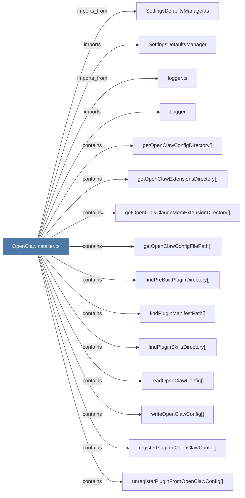

# OpenClawInstaller.ts

> [!info] Properties
> **File Type**: code
> **Community**: [[_COMMUNITY_Community None|Community None]]
> **Degree**: 20

## Architecture Graph


## Outbound Connections
- [[Logger]] - `imports` [EXTRACTED]
- [[SettingsDefaultsManager]] - `imports` [EXTRACTED]
- [[SettingsDefaultsManager.ts]] - `imports_from` [EXTRACTED]
- [[checkOpenClawStatus()]] - `contains` [EXTRACTED]
- [[copyPluginFilesAndRegister()]] - `contains` [EXTRACTED]
- [[findPluginManifestPath()]] - `contains` [EXTRACTED]
- [[findPluginSkillsDirectory()]] - `contains` [EXTRACTED]
- [[findPreBuiltPluginDirectory()]] - `contains` [EXTRACTED]
- [[getOpenClawClaudeMemExtensionDirectory()]] - `contains` [EXTRACTED]
- [[getOpenClawConfigDirectory()]] - `contains` [EXTRACTED]
- [[getOpenClawConfigFilePath()]] - `contains` [EXTRACTED]
- [[getOpenClawExtensionsDirectory()]] - `contains` [EXTRACTED]
- [[installOpenClawIntegration()]] - `contains` [EXTRACTED]
- [[installOpenClawPlugin()]] - `contains` [EXTRACTED]
- [[logger.ts]] - `imports_from` [EXTRACTED]
- [[readOpenClawConfig()]] - `contains` [EXTRACTED]
- [[registerPluginInOpenClawConfig()]] - `contains` [EXTRACTED]
- [[uninstallOpenClawPlugin()]] - `contains` [EXTRACTED]
- [[unregisterPluginFromOpenClawConfig()]] - `contains` [EXTRACTED]
- [[writeOpenClawConfig()]] - `contains` [EXTRACTED]

## Inbound Dependencies
> [!abstract]- Files that link here
```dataview
LIST
FROM [[OpenClawInstaller.ts]]
```

#graphify/code #graphify/EXTRACTED #community/Community_None