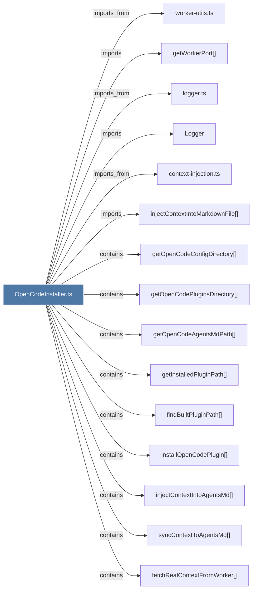

# OpenCodeInstaller.ts

> [!info] Properties
> **File Type**: code
> **Community**: [[_COMMUNITY_Community None|Community None]]
> **Degree**: 20

## Architecture Graph


## Outbound Connections
- [[Logger]] - `imports` [EXTRACTED]
- [[checkOpenCodeStatus()]] - `contains` [EXTRACTED]
- [[context-injection.ts]] - `imports_from` [EXTRACTED]
- [[fetchAndInjectOpenCodeContext()]] - `contains` [EXTRACTED]
- [[fetchRealContextFromWorker()]] - `contains` [EXTRACTED]
- [[findBuiltPluginPath()]] - `contains` [EXTRACTED]
- [[getInstalledPluginPath()]] - `contains` [EXTRACTED]
- [[getOpenCodeAgentsMdPath()]] - `contains` [EXTRACTED]
- [[getOpenCodeConfigDirectory()]] - `contains` [EXTRACTED]
- [[getOpenCodePluginsDirectory()]] - `contains` [EXTRACTED]
- [[getWorkerPort()]] - `imports` [EXTRACTED]
- [[injectContextIntoAgentsMd()]] - `contains` [EXTRACTED]
- [[injectContextIntoMarkdownFile()]] - `imports` [EXTRACTED]
- [[installOpenCodeIntegration()]] - `contains` [EXTRACTED]
- [[installOpenCodePlugin()]] - `contains` [EXTRACTED]
- [[logger.ts]] - `imports_from` [EXTRACTED]
- [[syncContextToAgentsMd()]] - `contains` [EXTRACTED]
- [[uninstallOpenCodePlugin()]] - `contains` [EXTRACTED]
- [[worker-utils.ts]] - `imports_from` [EXTRACTED]
- [[writeOrRemoveCleanedAgentsMd()]] - `contains` [EXTRACTED]

## Inbound Dependencies
> [!abstract]- Files that link here
```dataview
LIST
FROM [[OpenCodeInstaller.ts]]
```

#graphify/code #graphify/EXTRACTED #community/Community_None