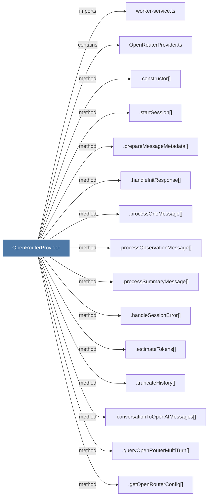

# OpenRouterProvider

> [!info] Properties
> **File Type**: code
> **Community**: [[_COMMUNITY_Community None|Community None]]
> **Degree**: 16

## Architecture Graph


## Outbound Connections
- [[.constructor()_10]] - `method` [EXTRACTED]
- [[.conversationToOpenAIMessages()]] - `method` [EXTRACTED]
- [[.estimateTokens()]] - `method` [EXTRACTED]
- [[.getOpenRouterConfig()]] - `method` [EXTRACTED]
- [[.handleInitResponse()]] - `method` [EXTRACTED]
- [[.handleSessionError()]] - `method` [EXTRACTED]
- [[.prepareMessageMetadata()]] - `method` [EXTRACTED]
- [[.processObservationMessage()]] - `method` [EXTRACTED]
- [[.processOneMessage()]] - `method` [EXTRACTED]
- [[.processSummaryMessage()]] - `method` [EXTRACTED]
- [[.queryOpenRouterMultiTurn()]] - `method` [EXTRACTED]
- [[.startSession()_1]] - `method` [EXTRACTED]
- [[.truncateHistory()]] - `method` [EXTRACTED]
- [[OpenRouterProvider.ts]] - `contains` [EXTRACTED]
- [[SessionRoutes.ts]] - `imports` [EXTRACTED]
- [[worker-service.ts]] - `imports` [EXTRACTED]

## Inbound Dependencies
> [!abstract]- Files that link here
```dataview
LIST
FROM [[OpenRouterProvider]]
```

#graphify/code #graphify/EXTRACTED #community/Community_None