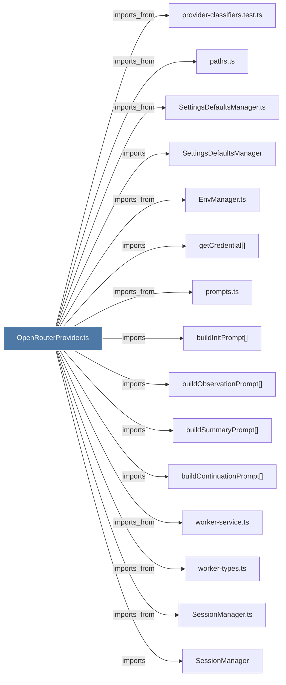

# OpenRouterProvider.ts

> [!info] Properties
> **File Type**: code
> **Community**: [[_COMMUNITY_Community None|Community None]]
> **Degree**: 33

## Architecture Graph


## Outbound Connections
- [[ClassifiedProviderError]] - `imports` [EXTRACTED]
- [[DatabaseManager]] - `imports` [EXTRACTED]
- [[DatabaseManager.ts]] - `imports_from` [EXTRACTED]
- [[EnvManager.ts]] - `imports_from` [EXTRACTED]
- [[Logger]] - `imports` [EXTRACTED]
- [[ModeManager]] - `imports` [EXTRACTED]
- [[ModeManager.ts]] - `imports_from` [EXTRACTED]
- [[OpenRouterProvider]] - `contains` [EXTRACTED]
- [[SessionManager]] - `imports` [EXTRACTED]
- [[SessionManager.ts]] - `imports_from` [EXTRACTED]
- [[SessionRoutes.ts]] - `imports_from` [EXTRACTED]
- [[SettingsDefaultsManager]] - `imports` [EXTRACTED]
- [[SettingsDefaultsManager.ts]] - `imports_from` [EXTRACTED]
- [[buildContinuationPrompt()]] - `imports` [EXTRACTED]
- [[buildInitPrompt()]] - `imports` [EXTRACTED]
- [[buildObservationPrompt()]] - `imports` [EXTRACTED]
- [[buildSummaryPrompt()]] - `imports` [EXTRACTED]
- [[classifyOpenRouterError()]] - `contains` [EXTRACTED]
- [[getCredential()]] - `imports` [EXTRACTED]
- [[index.ts_4]] - `imports_from` [EXTRACTED]
- [[isOpenRouterAvailable()]] - `contains` [EXTRACTED]
- [[isOpenRouterSelected()]] - `contains` [EXTRACTED]
- [[logger.ts]] - `imports_from` [EXTRACTED]
- [[parseRetryAfterMs()]] - `contains` [EXTRACTED]
- [[paths.ts]] - `imports_from` [EXTRACTED]
- [[prompts.ts]] - `imports_from` [EXTRACTED]
- [[provider-classifiers.test.ts]] - `imports_from` [EXTRACTED]
- [[provider-errors.ts]] - `imports_from` [EXTRACTED]
- [[retry.ts]] - `imports_from` [EXTRACTED]
- [[types.ts_5]] - `imports_from` [EXTRACTED]
- [[withRetry()]] - `imports` [EXTRACTED]
- [[worker-service.ts]] - `imports_from` [EXTRACTED]
- [[worker-types.ts]] - `imports_from` [EXTRACTED]

## Inbound Dependencies
> [!abstract]- Files that link here
```dataview
LIST
FROM [[OpenRouterProvider.ts]]
```

#graphify/code #graphify/EXTRACTED #community/Community_None