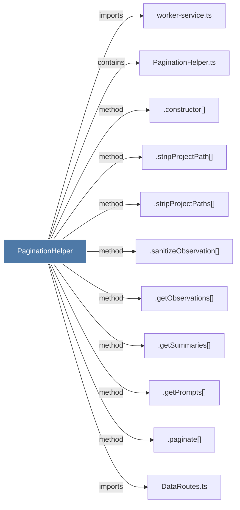

# PaginationHelper

> [!info] Properties
> **File Type**: code
> **Community**: [[_COMMUNITY_Community None|Community None]]
> **Degree**: 11

## Architecture Graph


## Outbound Connections
- [[.constructor()_7]] - `method` [EXTRACTED]
- [[.getObservations()]] - `method` [EXTRACTED]
- [[.getPrompts()]] - `method` [EXTRACTED]
- [[.getSummaries()]] - `method` [EXTRACTED]
- [[.paginate()]] - `method` [EXTRACTED]
- [[.sanitizeObservation()]] - `method` [EXTRACTED]
- [[.stripProjectPath()]] - `method` [EXTRACTED]
- [[.stripProjectPaths()]] - `method` [EXTRACTED]
- [[DataRoutes.ts]] - `imports` [EXTRACTED]
- [[PaginationHelper.ts]] - `contains` [EXTRACTED]
- [[worker-service.ts]] - `imports` [EXTRACTED]

## Inbound Dependencies
> [!abstract]- Files that link here
```dataview
LIST
FROM [[PaginationHelper]]
```

#graphify/code #graphify/EXTRACTED #community/Community_None