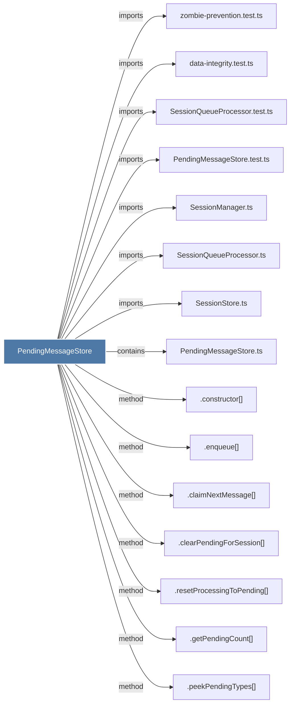

# PendingMessageStore

> [!info] Properties
> **File Type**: code
> **Community**: [[_COMMUNITY_Community None|Community None]]
> **Degree**: 16

## Architecture Graph


## Outbound Connections
- [[.claimNextMessage()]] - `method` [EXTRACTED]
- [[.clearPendingForSession()_1]] - `method` [EXTRACTED]
- [[.constructor()_37]] - `method` [EXTRACTED]
- [[.enqueue()]] - `method` [EXTRACTED]
- [[.getPendingCount()]] - `method` [EXTRACTED]
- [[.peekPendingTypes()]] - `method` [EXTRACTED]
- [[.resetProcessingToPending()]] - `method` [EXTRACTED]
- [[.toPendingMessage()]] - `method` [EXTRACTED]
- [[PendingMessageStore.test.ts]] - `imports` [EXTRACTED]
- [[PendingMessageStore.ts]] - `contains` [EXTRACTED]
- [[SessionManager.ts]] - `imports` [EXTRACTED]
- [[SessionQueueProcessor.test.ts]] - `imports` [EXTRACTED]
- [[SessionQueueProcessor.ts]] - `imports` [EXTRACTED]
- [[SessionStore.ts]] - `imports` [EXTRACTED]
- [[data-integrity.test.ts]] - `imports` [EXTRACTED]
- [[zombie-prevention.test.ts]] - `imports` [EXTRACTED]

## Inbound Dependencies
> [!abstract]- Files that link here
```dataview
LIST
FROM [[PendingMessageStore]]
```

#graphify/code #graphify/EXTRACTED #community/Community_None