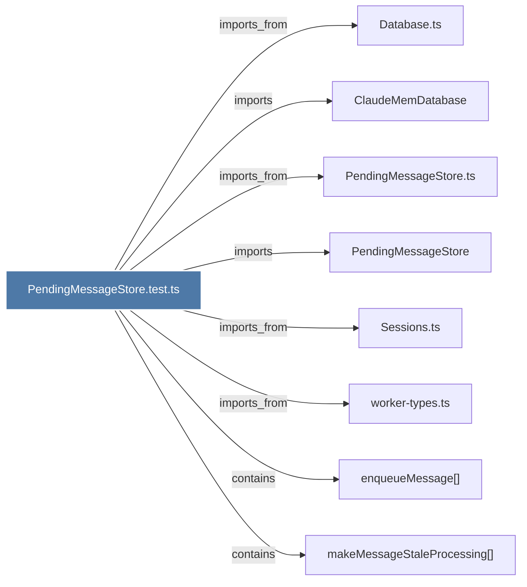

# PendingMessageStore.test.ts

> [!info] Properties
> **File Type**: code
> **Community**: [[_COMMUNITY_Community None|Community None]]
> **Degree**: 8

## Architecture Graph


## Outbound Connections
- [[ClaudeMemDatabase]] - `imports` [EXTRACTED]
- [[Database.ts]] - `imports_from` [EXTRACTED]
- [[PendingMessageStore]] - `imports` [EXTRACTED]
- [[PendingMessageStore.ts]] - `imports_from` [EXTRACTED]
- [[Sessions.ts]] - `imports_from` [EXTRACTED]
- [[enqueueMessage()]] - `contains` [EXTRACTED]
- [[makeMessageStaleProcessing()]] - `contains` [EXTRACTED]
- [[worker-types.ts]] - `imports_from` [EXTRACTED]

## Inbound Dependencies
> [!abstract]- Files that link here
```dataview
LIST
FROM [[PendingMessageStore.test.ts]]
```

#graphify/code #graphify/EXTRACTED #community/Community_None