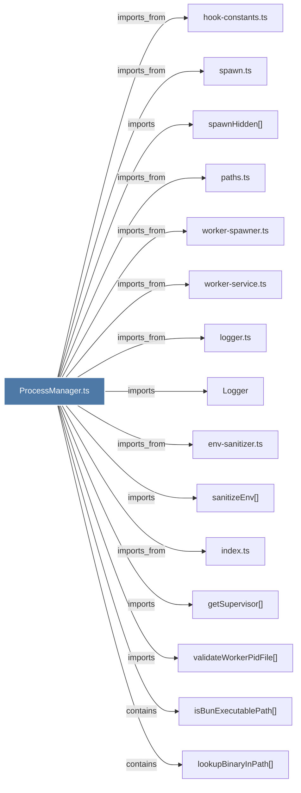

# ProcessManager.ts

> [!info] Properties
> **File Type**: code
> **Community**: [[_COMMUNITY_Community None|Community None]]
> **Degree**: 36

## Architecture Graph


## Outbound Connections
- [[Logger]] - `imports` [EXTRACTED]
- [[captureProcessStartToken()]] - `imports` [EXTRACTED]
- [[classifyCwdForRemap()]] - `contains` [EXTRACTED]
- [[cleanStalePidFile()]] - `contains` [EXTRACTED]
- [[env-sanitizer.ts]] - `imports_from` [EXTRACTED]
- [[executeCwdRemap()]] - `contains` [EXTRACTED]
- [[getChildProcesses()]] - `contains` [EXTRACTED]
- [[getPlatformTimeout()]] - `contains` [EXTRACTED]
- [[getSupervisor()]] - `imports` [EXTRACTED]
- [[gitQuery()]] - `contains` [EXTRACTED]
- [[hook-constants.ts]] - `imports_from` [EXTRACTED]
- [[index.ts_11]] - `imports_from` [EXTRACTED]
- [[isBunExecutablePath()]] - `contains` [EXTRACTED]
- [[isPidFileRecent()]] - `contains` [EXTRACTED]
- [[isProcessAlive()]] - `contains` [EXTRACTED]
- [[logger.ts]] - `imports_from` [EXTRACTED]
- [[lookupBinaryInPath()]] - `contains` [EXTRACTED]
- [[parseElapsedTime()]] - `contains` [EXTRACTED]
- [[paths.ts]] - `imports_from` [EXTRACTED]
- [[process-registry.ts]] - `imports_from` [EXTRACTED]
- [[readPidFile()]] - `contains` [EXTRACTED]
- [[removePidFile()]] - `contains` [EXTRACTED]
- [[resolveWorkerRuntimePath()]] - `contains` [EXTRACTED]
- [[resolveWorkerRuntimePathUncached()]] - `contains` [EXTRACTED]
- [[runOneTimeChromaMigration()]] - `contains` [EXTRACTED]
- [[runOneTimeCwdRemap()]] - `contains` [EXTRACTED]
- [[sanitizeEnv()]] - `imports` [EXTRACTED]
- [[spawn.ts]] - `imports_from` [EXTRACTED]
- [[spawnDaemon()]] - `contains` [EXTRACTED]
- [[spawnHidden()]] - `imports` [EXTRACTED]
- [[touchPidFile()]] - `contains` [EXTRACTED]
- [[validateWorkerPidFile()]] - `imports` [EXTRACTED]
- [[verifyPidFileOwnership()]] - `imports` [EXTRACTED]
- [[worker-service.ts]] - `imports_from` [EXTRACTED]
- [[worker-spawner.ts]] - `imports_from` [EXTRACTED]
- [[writePidFile()]] - `contains` [EXTRACTED]

## Inbound Dependencies
> [!abstract]- Files that link here
```dataview
LIST
FROM [[ProcessManager.ts]]
```

#graphify/code #graphify/EXTRACTED #community/Community_None