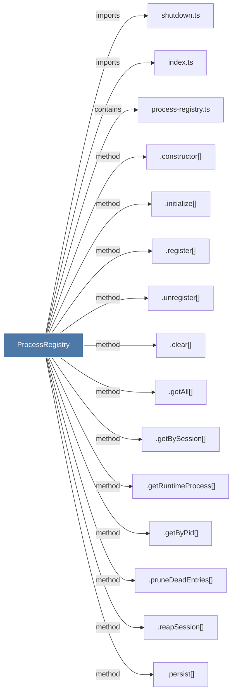

# ProcessRegistry

> [!info] Properties
> **File Type**: code
> **Community**: [[_COMMUNITY_Community None|Community None]]
> **Degree**: 15

## Architecture Graph


## Outbound Connections
- [[.clear()_3]] - `method` [EXTRACTED]
- [[.constructor()_46]] - `method` [EXTRACTED]
- [[.getAll()_1]] - `method` [EXTRACTED]
- [[.getByPid()]] - `method` [EXTRACTED]
- [[.getBySession()]] - `method` [EXTRACTED]
- [[.getRuntimeProcess()]] - `method` [EXTRACTED]
- [[.initialize()_3]] - `method` [EXTRACTED]
- [[.persist()]] - `method` [EXTRACTED]
- [[.pruneDeadEntries()]] - `method` [EXTRACTED]
- [[.reapSession()]] - `method` [EXTRACTED]
- [[.register()_1]] - `method` [EXTRACTED]
- [[.unregister()]] - `method` [EXTRACTED]
- [[index.ts_11]] - `imports` [EXTRACTED]
- [[process-registry.ts]] - `contains` [EXTRACTED]
- [[shutdown.ts]] - `imports` [EXTRACTED]

## Inbound Dependencies
> [!abstract]- Files that link here
```dataview
LIST
FROM [[ProcessRegistry]]
```

#graphify/code #graphify/EXTRACTED #community/Community_None