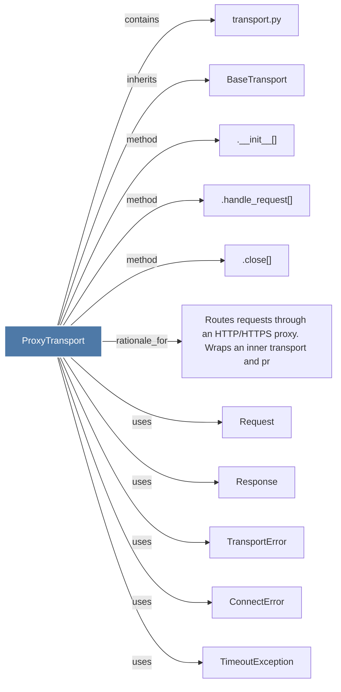

# ProxyTransport

> [!info] Properties
> **File Type**: code
> **Community**: [[_COMMUNITY_Community None|Community None]]
> **Degree**: 11

## Architecture Graph


## Outbound Connections
- [[.__init__()_9]] - `method` [EXTRACTED]
- [[.close()_3]] - `method` [EXTRACTED]
- [[.handle_request()_3]] - `method` [EXTRACTED]
- [[BaseTransport]] - `inherits` [EXTRACTED]
- [[ConnectError]] - `uses` [INFERRED]
- [[Request]] - `uses` [INFERRED]
- [[Response]] - `uses` [INFERRED]
- [[Routes requests through an HTTPHTTPS proxy.     Wraps an inner transport and pr]] - `rationale_for` [EXTRACTED]
- [[TimeoutException]] - `uses` [INFERRED]
- [[TransportError]] - `uses` [INFERRED]
- [[transport.py]] - `contains` [EXTRACTED]

## Inbound Dependencies
> [!abstract]- Files that link here
```dataview
LIST
FROM [[ProxyTransport]]
```

#graphify/code #graphify/EXTRACTED #community/Community_None