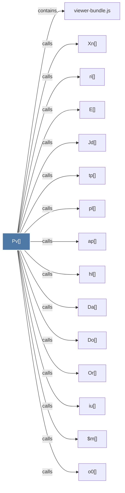

# Pv()

> [!info] Properties
> **File Type**: code
> **Community**: [[_COMMUNITY_Community None|Community None]]
> **Degree**: 18

## Architecture Graph


## Outbound Connections
- [[$m()]] - `calls` [EXTRACTED]
- [[Da()]] - `calls` [EXTRACTED]
- [[Do()]] - `calls` [EXTRACTED]
- [[E()]] - `calls` [EXTRACTED]
- [[Jd()]] - `calls` [EXTRACTED]
- [[Or()]] - `calls` [EXTRACTED]
- [[Sg()]] - `calls` [EXTRACTED]
- [[Xn()]] - `calls` [EXTRACTED]
- [[ap()]] - `calls` [EXTRACTED]
- [[hl()]] - `calls` [EXTRACTED]
- [[iu()]] - `calls` [EXTRACTED]
- [[o0()]] - `calls` [EXTRACTED]
- [[pl()]] - `calls` [EXTRACTED]
- [[qt()]] - `calls` [EXTRACTED]
- [[ri()]] - `calls` [EXTRACTED]
- [[rt()]] - `calls` [EXTRACTED]
- [[tp()]] - `calls` [EXTRACTED]
- [[viewer-bundle.js]] - `contains` [EXTRACTED]

## Inbound Dependencies
> [!abstract]- Files that link here
```dataview
LIST
FROM [[Pv()]]
```

#graphify/code #graphify/EXTRACTED #community/Community_None