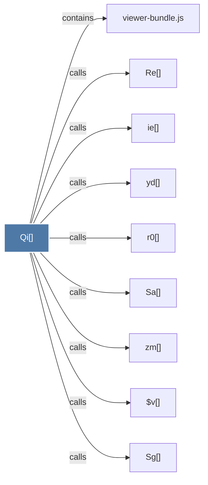

# Qi()

> [!info] Properties
> **File Type**: code
> **Community**: [[_COMMUNITY_Community None|Community None]]
> **Degree**: 9

## Architecture Graph


## Outbound Connections
- [[$v()]] - `calls` [EXTRACTED]
- [[Re()]] - `calls` [EXTRACTED]
- [[Sa()]] - `calls` [EXTRACTED]
- [[Sg()]] - `calls` [EXTRACTED]
- [[ie()]] - `calls` [EXTRACTED]
- [[r0()]] - `calls` [EXTRACTED]
- [[viewer-bundle.js]] - `contains` [EXTRACTED]
- [[yd()]] - `calls` [EXTRACTED]
- [[zm()]] - `calls` [EXTRACTED]

## Inbound Dependencies
> [!abstract]- Files that link here
```dataview
LIST
FROM [[Qi()]]
```

#graphify/code #graphify/EXTRACTED #community/Community_None