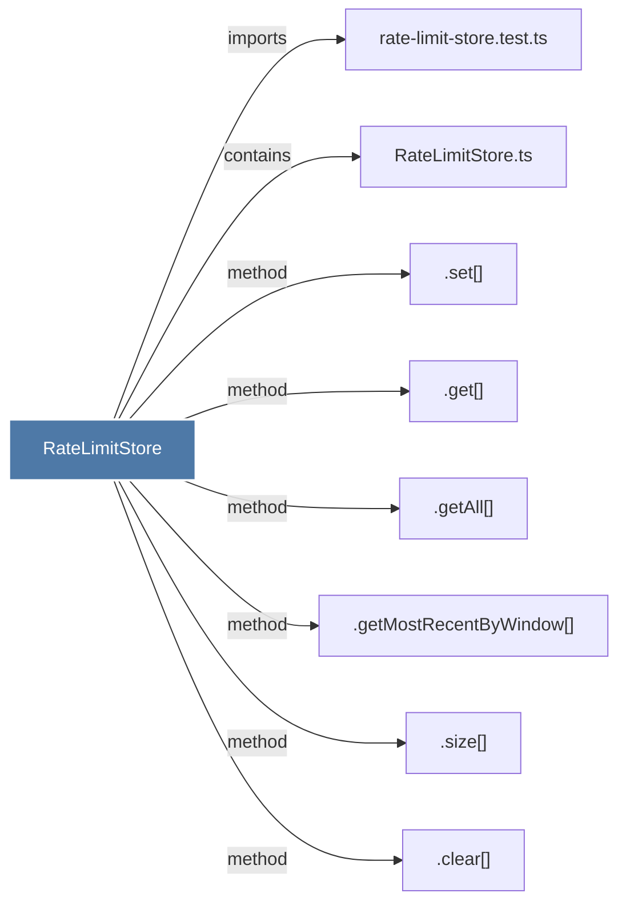

# RateLimitStore

> [!info] Properties
> **File Type**: code
> **Community**: [[_COMMUNITY_Community None|Community None]]
> **Degree**: 8

## Architecture Graph


## Outbound Connections
- [[.clear()_2]] - `method` [EXTRACTED]
- [[.get()_8]] - `method` [EXTRACTED]
- [[.getAll()]] - `method` [EXTRACTED]
- [[.getMostRecentByWindow()]] - `method` [EXTRACTED]
- [[.set()_1]] - `method` [EXTRACTED]
- [[.size()]] - `method` [EXTRACTED]
- [[RateLimitStore.ts]] - `contains` [EXTRACTED]
- [[rate-limit-store.test.ts]] - `imports` [EXTRACTED]

## Inbound Dependencies
> [!abstract]- Files that link here
```dataview
LIST
FROM [[RateLimitStore]]
```

#graphify/code #graphify/EXTRACTED #community/Community_None