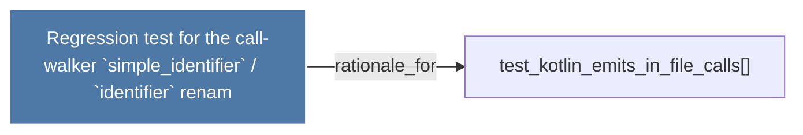

# Regression test for the call-walker `simple_identifier` /     `identifier` renam

> [!info] Properties
> **File Type**: rationale
> **Community**: [[_COMMUNITY_Community None|Community None]]
> **Degree**: 1

## Architecture Graph


## Outbound Connections
- [[test_kotlin_emits_in_file_calls()]] - `rationale_for` [EXTRACTED]

## Inbound Dependencies
> [!abstract]- Files that link here
```dataview
LIST
FROM [[Regression test for the call-walker `simple_identifier`      `identifier` renam]]
```

#graphify/rationale #graphify/EXTRACTED #community/Community_None