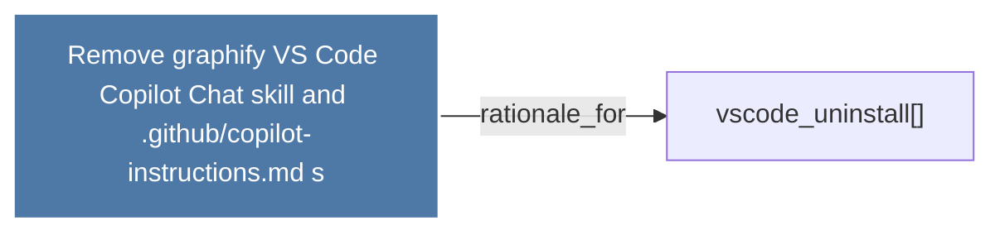

# Remove graphify VS Code Copilot Chat skill and .github/copilot-instructions.md s

> [!info] Properties
> **File Type**: rationale
> **Community**: [[_COMMUNITY_Community None|Community None]]
> **Degree**: 1

## Architecture Graph


## Outbound Connections
- [[vscode_uninstall()]] - `rationale_for` [EXTRACTED]

## Inbound Dependencies
> [!abstract]- Files that link here
```dataview
LIST
FROM [[Remove graphify VS Code Copilot Chat skill and .githubcopilot-instructions.md s]]
```

#graphify/rationale #graphify/EXTRACTED #community/Community_None