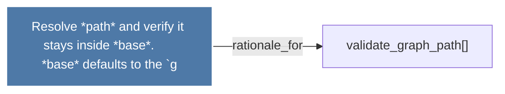

# Resolve *path* and verify it stays inside *base*.      *base* defaults to the `g

> [!info] Properties
> **File Type**: rationale
> **Community**: [[_COMMUNITY_Community None|Community None]]
> **Degree**: 1

## Architecture Graph


## Outbound Connections
- [[validate_graph_path()]] - `rationale_for` [EXTRACTED]

## Inbound Dependencies
> [!abstract]- Files that link here
```dataview
LIST
FROM [[Resolve path and verify it stays inside base.      base defaults to the `g]]
```

#graphify/rationale #graphify/EXTRACTED #community/Community_None