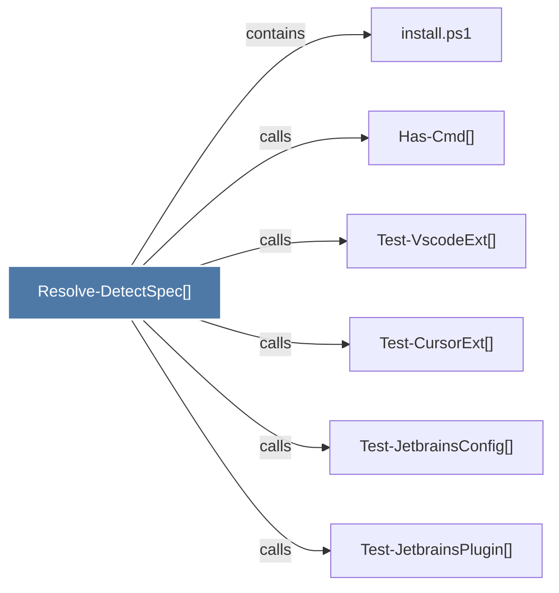

# Resolve-DetectSpec()

> [!info] Properties
> **File Type**: code
> **Community**: [[_COMMUNITY_Community None|Community None]]
> **Degree**: 6

## Architecture Graph


## Outbound Connections
- [[Has-Cmd()]] - `calls` [EXTRACTED]
- [[Test-CursorExt()]] - `calls` [EXTRACTED]
- [[Test-JetbrainsConfig()]] - `calls` [EXTRACTED]
- [[Test-JetbrainsPlugin()]] - `calls` [EXTRACTED]
- [[Test-VscodeExt()]] - `calls` [EXTRACTED]
- [[install.ps1]] - `contains` [EXTRACTED]

## Inbound Dependencies
> [!abstract]- Files that link here
```dataview
LIST
FROM [[Resolve-DetectSpec()]]
```

#graphify/code #graphify/EXTRACTED #community/Community_None