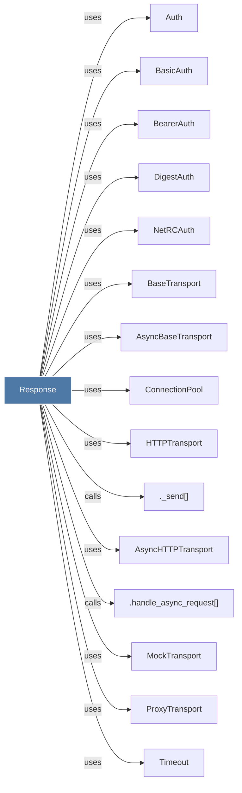

# Response

> [!info] Properties
> **File Type**: code
> **Community**: [[_COMMUNITY_Community None|Community None]]
> **Degree**: 26

## Architecture Graph


## Outbound Connections
- [[.__init__()_19]] - `method` [EXTRACTED]
- [[.__repr__()_2]] - `method` [EXTRACTED]
- [[._send()]] - `calls` [INFERRED]
- [[.handle_async_request()_1]] - `calls` [INFERRED]
- [[.json()]] - `method` [EXTRACTED]
- [[.raise_for_status()]] - `method` [EXTRACTED]
- [[.read()]] - `method` [EXTRACTED]
- [[AsyncBaseTransport]] - `uses` [INFERRED]
- [[AsyncClient]] - `uses` [INFERRED]
- [[AsyncHTTPTransport]] - `uses` [INFERRED]
- [[Auth]] - `uses` [INFERRED]
- [[BaseClient]] - `uses` [INFERRED]
- [[BaseTransport]] - `uses` [INFERRED]
- [[BasicAuth]] - `uses` [INFERRED]
- [[BearerAuth]] - `uses` [INFERRED]
- [[Client]] - `uses` [INFERRED]
- [[ConnectionPool]] - `uses` [INFERRED]
- [[DigestAuth]] - `uses` [INFERRED]
- [[HTTPStatusError]] - `uses` [INFERRED]
- [[HTTPTransport]] - `uses` [INFERRED]
- [[Limits]] - `uses` [INFERRED]
- [[MockTransport]] - `uses` [INFERRED]
- [[NetRCAuth]] - `uses` [INFERRED]
- [[ProxyTransport]] - `uses` [INFERRED]
- [[Timeout]] - `uses` [INFERRED]
- [[models.py]] - `contains` [EXTRACTED]

## Inbound Dependencies
> [!abstract]- Files that link here
```dataview
LIST
FROM [[Response]]
```

#graphify/code #graphify/INFERRED #community/Community_None