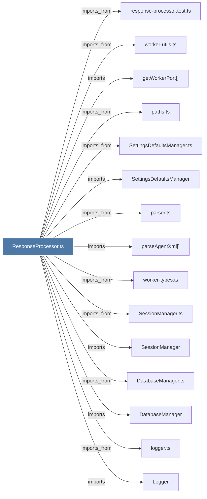

# ResponseProcessor.ts

> [!info] Properties
> **File Type**: code
> **Community**: [[_COMMUNITY_Community None|Community None]]
> **Degree**: 31

## Architecture Graph


## Outbound Connections
- [[CursorHooksInstaller.ts]] - `imports_from` [EXTRACTED]
- [[DatabaseManager]] - `imports` [EXTRACTED]
- [[DatabaseManager.ts]] - `imports_from` [EXTRACTED]
- [[Logger]] - `imports` [EXTRACTED]
- [[ObservationBroadcaster.ts]] - `imports_from` [EXTRACTED]
- [[SessionManager]] - `imports` [EXTRACTED]
- [[SessionManager.ts]] - `imports_from` [EXTRACTED]
- [[SettingsDefaultsManager]] - `imports` [EXTRACTED]
- [[SettingsDefaultsManager.ts]] - `imports_from` [EXTRACTED]
- [[TelegramNotifier.ts]] - `imports_from` [EXTRACTED]
- [[broadcastObservation()]] - `imports` [EXTRACTED]
- [[broadcastSummary()]] - `imports` [EXTRACTED]
- [[claude-md-utils.ts]] - `imports_from` [EXTRACTED]
- [[getWorkerPort()]] - `imports` [EXTRACTED]
- [[ingestSummary()]] - `imports` [EXTRACTED]
- [[logger.ts]] - `imports_from` [EXTRACTED]
- [[normalizeSummaryForStorage()]] - `contains` [EXTRACTED]
- [[notifyTelegram()]] - `imports` [EXTRACTED]
- [[parseAgentXml()]] - `imports` [EXTRACTED]
- [[parser.ts]] - `imports_from` [EXTRACTED]
- [[paths.ts]] - `imports_from` [EXTRACTED]
- [[processAgentResponse()]] - `contains` [EXTRACTED]
- [[response-processor.test.ts]] - `imports_from` [EXTRACTED]
- [[shared.ts]] - `imports_from` [EXTRACTED]
- [[syncAndBroadcastObservations()]] - `contains` [EXTRACTED]
- [[syncAndBroadcastSummary()]] - `contains` [EXTRACTED]
- [[types.ts_1]] - `imports_from` [EXTRACTED]
- [[updateCursorContextForProject()]] - `imports` [EXTRACTED]
- [[updateFolderClaudeMdFiles()]] - `imports` [EXTRACTED]
- [[worker-types.ts]] - `imports_from` [EXTRACTED]
- [[worker-utils.ts]] - `imports_from` [EXTRACTED]

## Inbound Dependencies
> [!abstract]- Files that link here
```dataview
LIST
FROM [[ResponseProcessor.ts]]
```

#graphify/code #graphify/EXTRACTED #community/Community_None