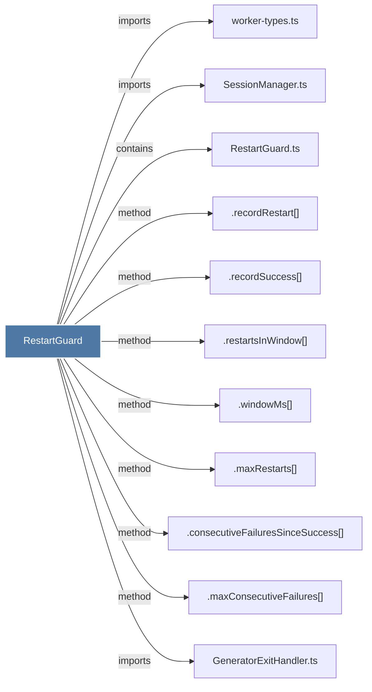

# RestartGuard

> [!info] Properties
> **File Type**: code
> **Community**: [[_COMMUNITY_Community None|Community None]]
> **Degree**: 11

## Architecture Graph


## Outbound Connections
- [[.consecutiveFailuresSinceSuccess()]] - `method` [EXTRACTED]
- [[.maxConsecutiveFailures()]] - `method` [EXTRACTED]
- [[.maxRestarts()]] - `method` [EXTRACTED]
- [[.recordRestart()]] - `method` [EXTRACTED]
- [[.recordSuccess()]] - `method` [EXTRACTED]
- [[.restartsInWindow()]] - `method` [EXTRACTED]
- [[.windowMs()]] - `method` [EXTRACTED]
- [[GeneratorExitHandler.ts]] - `imports` [EXTRACTED]
- [[RestartGuard.ts]] - `contains` [EXTRACTED]
- [[SessionManager.ts]] - `imports` [EXTRACTED]
- [[worker-types.ts]] - `imports` [EXTRACTED]

## Inbound Dependencies
> [!abstract]- Files that link here
```dataview
LIST
FROM [[RestartGuard]]
```

#graphify/code #graphify/EXTRACTED #community/Community_None