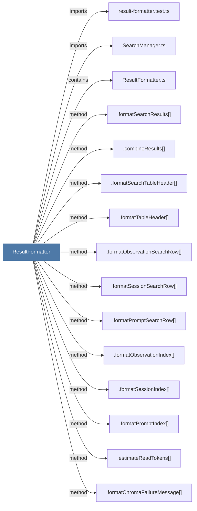

# ResultFormatter

> [!info] Properties
> **File Type**: code
> **Community**: [[_COMMUNITY_Community None|Community None]]
> **Degree**: 17

## Architecture Graph


## Outbound Connections
- [[.combineResults()]] - `method` [EXTRACTED]
- [[.estimateReadTokens()_1]] - `method` [EXTRACTED]
- [[.formatChromaFailureMessage()]] - `method` [EXTRACTED]
- [[.formatObservationIndex()_1]] - `method` [EXTRACTED]
- [[.formatObservationSearchRow()_1]] - `method` [EXTRACTED]
- [[.formatPromptIndex()]] - `method` [EXTRACTED]
- [[.formatPromptSearchRow()]] - `method` [EXTRACTED]
- [[.formatSearchResults()]] - `method` [EXTRACTED]
- [[.formatSearchTableHeader()_1]] - `method` [EXTRACTED]
- [[.formatSearchTips()_1]] - `method` [EXTRACTED]
- [[.formatSessionIndex()_1]] - `method` [EXTRACTED]
- [[.formatSessionSearchRow()_1]] - `method` [EXTRACTED]
- [[.formatTableHeader()_1]] - `method` [EXTRACTED]
- [[ResultFormatter.ts]] - `contains` [EXTRACTED]
- [[SearchManager.ts]] - `imports` [EXTRACTED]
- [[SearchOrchestrator.ts]] - `imports` [EXTRACTED]
- [[result-formatter.test.ts]] - `imports` [EXTRACTED]

## Inbound Dependencies
> [!abstract]- Files that link here
```dataview
LIST
FROM [[ResultFormatter]]
```

#graphify/code #graphify/EXTRACTED #community/Community_None