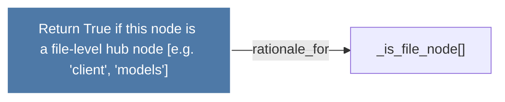

# Return True if this node is a file-level hub node (e.g. 'client', 'models')

> [!info] Properties
> **File Type**: rationale
> **Community**: [[_COMMUNITY_Community None|Community None]]
> **Degree**: 1

## Architecture Graph


## Outbound Connections
- [[_is_file_node()]] - `rationale_for` [EXTRACTED]

## Inbound Dependencies
> [!abstract]- Files that link here
```dataview
LIST
FROM [[Return True if this node is a file-level hub node (e.g. 'client', 'models')]]
```

#graphify/rationale #graphify/EXTRACTED #community/Community_None