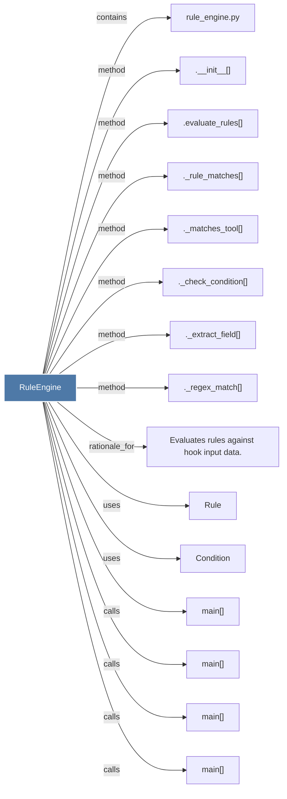

# RuleEngine

> [!info] Properties
> **File Type**: code
> **Community**: [[_COMMUNITY_Community None|Community None]]
> **Degree**: 15

## Architecture Graph


## Outbound Connections
- [[.__init__()_22]] - `method` [EXTRACTED]
- [[._check_condition()]] - `method` [EXTRACTED]
- [[._extract_field()]] - `method` [EXTRACTED]
- [[._matches_tool()]] - `method` [EXTRACTED]
- [[._regex_match()]] - `method` [EXTRACTED]
- [[._rule_matches()]] - `method` [EXTRACTED]
- [[.evaluate_rules()]] - `method` [EXTRACTED]
- [[Condition]] - `uses` [INFERRED]
- [[Evaluates rules against hook input data.]] - `rationale_for` [EXTRACTED]
- [[Rule]] - `uses` [INFERRED]
- [[main()_4]] - `calls` [INFERRED]
- [[main()_5]] - `calls` [INFERRED]
- [[main()_6]] - `calls` [INFERRED]
- [[main()_7]] - `calls` [INFERRED]
- [[rule_engine.py]] - `contains` [EXTRACTED]

## Inbound Dependencies
> [!abstract]- Files that link here
```dataview
LIST
FROM [[RuleEngine]]
```

#graphify/code #graphify/EXTRACTED #community/Community_None