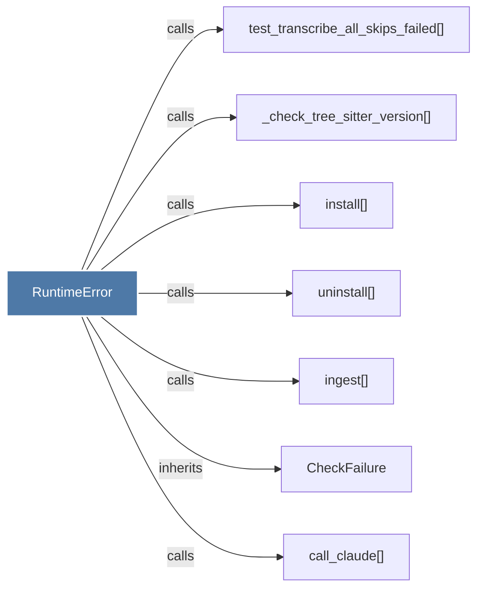

# RuntimeError

> [!info] Properties
> **File Type**: code
> **Community**: [[_COMMUNITY_Community None|Community None]]
> **Degree**: 7

## Architecture Graph


## Outbound Connections
- [[CheckFailure]] - `inherits` [EXTRACTED]
- [[_check_tree_sitter_version()]] - `calls` [INFERRED]
- [[call_claude()]] - `calls` [INFERRED]
- [[ingest()]] - `calls` [INFERRED]
- [[install()]] - `calls` [INFERRED]
- [[test_transcribe_all_skips_failed()]] - `calls` [INFERRED]
- [[uninstall()]] - `calls` [INFERRED]

## Inbound Dependencies
> [!abstract]- Files that link here
```dataview
LIST
FROM [[RuntimeError]]
```

#graphify/code #graphify/INFERRED #community/Community_None