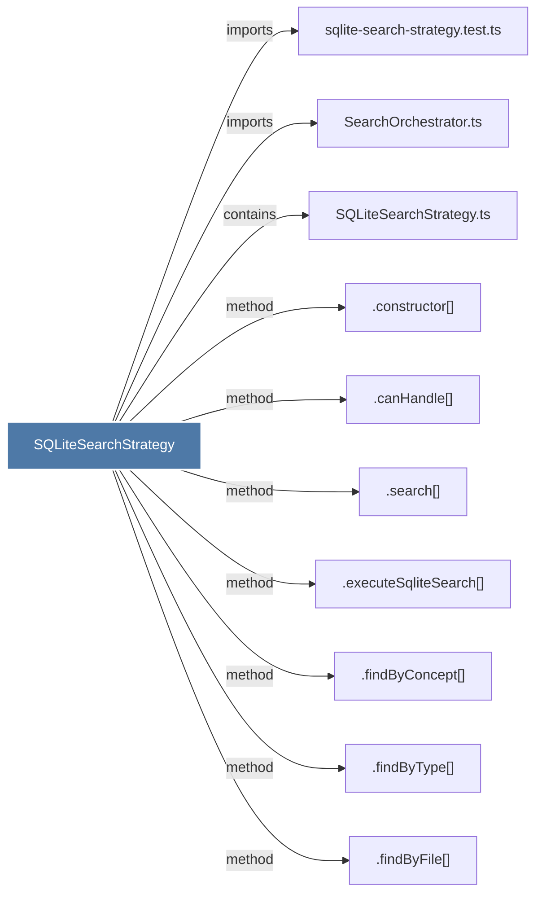

# SQLiteSearchStrategy

> [!info] Properties
> **File Type**: code
> **Community**: [[_COMMUNITY_Community None|Community None]]
> **Degree**: 10

## Architecture Graph


## Outbound Connections
- [[.canHandle()]] - `method` [EXTRACTED]
- [[.constructor()_15]] - `method` [EXTRACTED]
- [[.executeSqliteSearch()]] - `method` [EXTRACTED]
- [[.findByConcept()_1]] - `method` [EXTRACTED]
- [[.findByFile()_1]] - `method` [EXTRACTED]
- [[.findByType()_1]] - `method` [EXTRACTED]
- [[.search()_2]] - `method` [EXTRACTED]
- [[SQLiteSearchStrategy.ts]] - `contains` [EXTRACTED]
- [[SearchOrchestrator.ts]] - `imports` [EXTRACTED]
- [[sqlite-search-strategy.test.ts]] - `imports` [EXTRACTED]

## Inbound Dependencies
> [!abstract]- Files that link here
```dataview
LIST
FROM [[SQLiteSearchStrategy]]
```

#graphify/code #graphify/EXTRACTED #community/Community_None