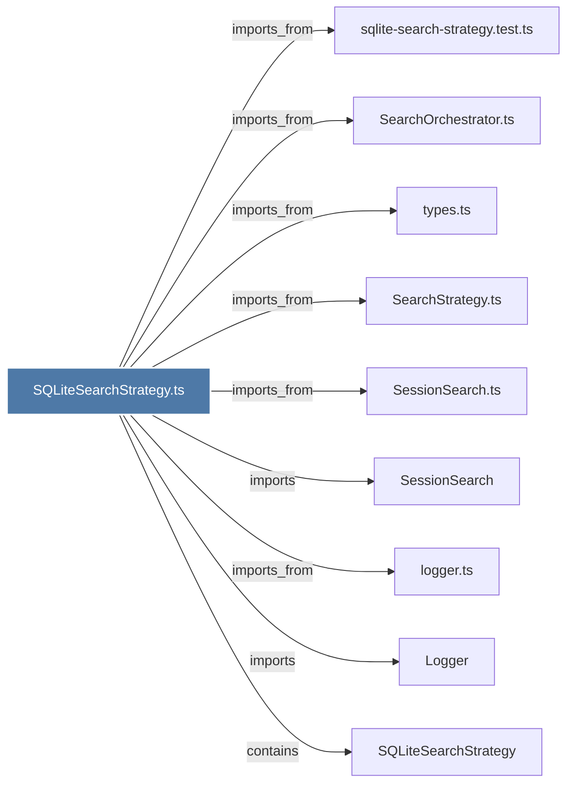

# SQLiteSearchStrategy.ts

> [!info] Properties
> **File Type**: code
> **Community**: [[_COMMUNITY_Community None|Community None]]
> **Degree**: 9

## Architecture Graph


## Outbound Connections
- [[Logger]] - `imports` [EXTRACTED]
- [[SQLiteSearchStrategy]] - `contains` [EXTRACTED]
- [[SearchOrchestrator.ts]] - `imports_from` [EXTRACTED]
- [[SearchStrategy.ts]] - `imports_from` [EXTRACTED]
- [[SessionSearch]] - `imports` [EXTRACTED]
- [[SessionSearch.ts]] - `imports_from` [EXTRACTED]
- [[logger.ts]] - `imports_from` [EXTRACTED]
- [[sqlite-search-strategy.test.ts]] - `imports_from` [EXTRACTED]
- [[types.ts_2]] - `imports_from` [EXTRACTED]

## Inbound Dependencies
> [!abstract]- Files that link here
```dataview
LIST
FROM [[SQLiteSearchStrategy.ts]]
```

#graphify/code #graphify/EXTRACTED #community/Community_None